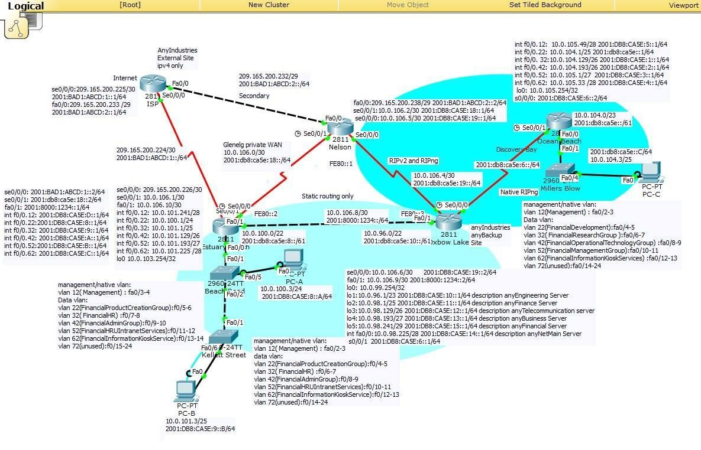
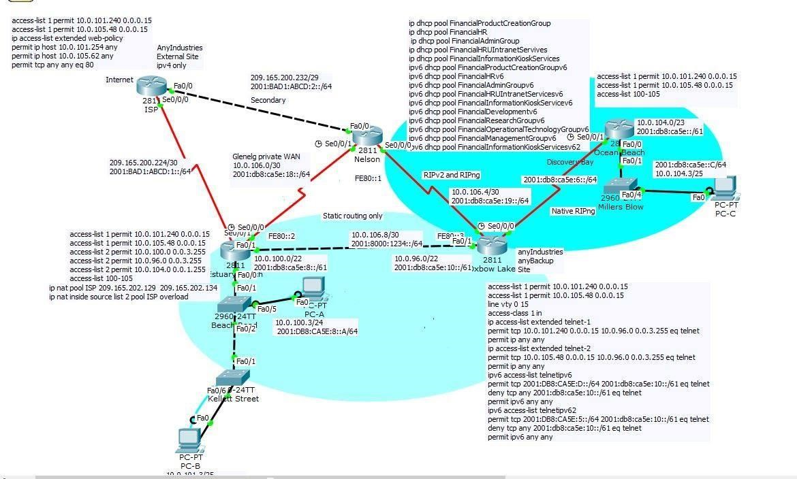

anyIndustries will implement the final configurations into the networking site to complete the network design requirements. The company wishes to install the IPv4 and IPv6 access control lists that will address the security policies of restricting internet traffic from ISP router to http only, Management VLANs opening Telnet sessions to the anyBackupMain network but denied access to ISP, network administrator having unrestricted access, restricting vlan hosts to only be able to ping to gateway addresses and denying Telnet access while having unrestricted access to the remainder of the network and VLANs (except Management VLAN) to be denied IPv6 Telnet access to the anyBackupMain network. VTY lines will be configured to enable VTY secure shell login. DHCP services will then be secured by enabling DHCP snooping for the DHCP address allocation. On the Estuary Beach Site, DHCPv4 will be performed where hosts will dynamically be allocated IPv4 addresses from the DHCPv4 server on Oxbow Lake Router. Network administrators will have static addresses while all other hosts will be allocated dynamic addresses and that 10% of the first and last available usable host addresses in each subnet will be reserved for addressing the internetworking devices. IPv6 addressing requirements will include the switches’ management SVI interface to obtain IPv6 addresses through SLAAC and that hosts on the VLAN will receive their domain name and DNS server address from a DHCPv6 server on the Oxbow Lake Router. NAT will also be implemented where all users will be allocated addresses dynamically with overload except static NAT will be used on the anyNetMain and anyFinancial hosts. Verification of the functional prototype of the switching network will also be provided to show that it fulfills the design requirements. A demonstration of the completed design will be done to show the functionality of the network site.

## Topology Diagram 

##  Securing the Network Deliverables

**Summary of the Access Control Lists Used:**

●      For policy 1, the ISP router will be configured on the interface ports se0/0/0 and fa0/0 so only internet traffic to and from the ISP router is restricted to HTTP only. This will be done through the command “ip access-group web-policy in” and “ip access-group web-policy out”. Extended access list will also be used to allow the network administrator in policy 3 to be permitted to connect to port 80 (Internet).

●      For policy 2, the Oxbow Lake router will have an extended access list that will allow the Management VLANs on the Estuary Beach Router and Ocean Beach Router to be allowed to open a Telnet session through the command “ip access-list extended telnet-1”, followed by permitting the Management VLAN to open a telnet session to the anyBackupMain network. They will be able to connect to the anyBackupMain networks while also being denied access to the ISP. An access list 1 will also be created to permit the Management VLANs at Estuary Beach and Ocean Beach to connect to Oxbow Lake Router. Both access list configured will be going inbound.

●      For policy 3, an extended access list for web policy will be used where the network administrator located on the Management VLANs will have unrestricted access throughout the network and out on the internet through the ISP which is to be configured on the ISP router. It will then be configured to permit the network administrator (10.0.101.254 and 10.0.105.62) to have access throughout the network and out on the internet which is further show by permitting the tcp to any access on port 80 (internet). The VTY lines will also be configured to permit the management VLANs that will go inbound and connect to http server.

●      For Policy 4, hosts on VLANs located on the Estuary Beach and Ocean Beach site will be denied pinging to each other and only be permitted to ping to the gateway addresses. The extended ACL will be created for each VLAN. It will start through the permit command in which it will permit the gateway addresses to be allowed to ping to from the hosts. It will then be followed by deny statements in which it states that hosts on the VLANs will be restricted traffic to prevent hosts from pinging each other. Another deny statement will be created to deny user VLANs from having telnet access. It will conclude by permitting any to have unrestricted access to the remainder of the company network and the Internet. The access list will be going inbound. 

●      For policy 5, the IPv6 access control list will configured to make sure that all VLANs except for the Management VLAN are denied Telnet access to the anyBackupMain network. There will be two access lists configured on the Oxbow Lake Router for the VLANs on Estuary Beach and Ocean Beach. This is shown by the ACL “ipv6 access-list telnet-1” followed by permitting Management VLAN to have telnet access. The deny statement will deny the IPv6 summary routes of Estuary Beach and Ocean Beach from having telnet access. Both access list will be configured to be inbound. 

**Table G: Access Control List Tables**

| Policy           | Number or Name | Standard or Extended | Permit or deny | Protocol      | source                | destination           | ACL applied details                |
| ---------------- | -------------- | -------------------- | -------------- | ------------- | --------------------- | --------------------- | ---------------------------------- |
| Ip Access-list   | Web-policy     | extended             | permit         | ip            | 10.0.101.254          | any                   | ISP s0/0/0,fa0/0/0 in and   out    |
| Ip Access-list   | Web-policy     | extended             | permit         | ip            | 10.0.105.62           | any                   | ISP s0/0/0,fa0/0/0 in and   out    |
| Ip Access-list   | Web-policy     | extended             | permit         | Tcp eq 80     | any                   | any                   | ISP s0/0/0,fa0/0/0 in and   out    |
| Ip Access-list   | 100            | Extended             | permit         | ip            | 10.0.101.254          | any                   | Estuary fa0/0.12, in               |
| Ip Access-list   | 100            | Extended             | Permit         | Ip            | Any                   | 10.0.101.241          | Estuary fa0/0.12, in               |
| Ip Access-list   | 100            | extended             | Permit         | Ip            | any                   | 10.0.100.1            | Estuary fa0/0.12, in               |
| Ip Access-list   | 100            | Extended             | Permit         | Ip            | Any                   | 10.0.101.1            | Estuary fa0/0.12, in               |
| Ip Access-list   | 100            | Extended             | Permit         | Ip            | Any                   | 10.0.101.129          | Estuary fa0/0.12, in               |
| Ip Access-list   | 100            | Extended             | Permit         | Ip            | Any                   | 10.0.101.193          | Estuary fa0/0.12, in               |
| Ip Access-list   | 100            | Extended             | Permit         | Ip            | Any                   | 10.0.101.225          | Estuary fa0/0.12, in               |
| Ip Access-list   | 100            | Extended             | Deny           | Ip            | 10.0.101.240 0.0.0.15 | 10.0.100.0 0.0.0.255  | Estuary fa0/0.12, in               |
| Ip Access-list   | 100            | Extended             | deny           | Ip            | 10.0.101.240 0.0.0.15 | 10.0.101.0 0.0.0.127  | Estuary fa0/0.12, in               |
| Ip Access-list   | 100            | Extended             | deny           | Ip            | 10.0.101.240 0.0.0.15 | 10.0.101.128 0.0.0.63 | Estuary fa0/0.12, in               |
| Ip Access-list   | 100            | Extended             | deny           | Ip            | 10.0.101.240 0.0.0.15 | 10.0.101.192 0.0.0.31 | Estuary fa0/0.12, in               |
| Ip Access-list   | 100            | Extended             | deny           | Ip            | 10.0.101.240 0.0.0.15 | 10.0.101.224 0.0.0.15 | Estuary fa0/0.12, in               |
| Ip Access-list   | 100            | Extended             | permit         | Ip            | any                   | any                   | Estuary fa0/0.12, in               |
| Ip Access-list   | 101            | Extended             | Permit         | Ip            | Any                   | 10.0.101.241          | Estuary fa0/0.22, in               |
| Ip Access-list   | 101            | Extended             | Permit         | Ip            | any                   | 10.0.100.1            | Estuary fa0/0.22, in               |
| Ip Access-list   | 101            | Extended             | Permit         | Ip            | Any                   | 10.0.101.1            | Estuary fa0/0.22, in               |
| Ip Access-list   | 101            | Extended             | Permit         | Ip            | Any                   | 10.0.101.129          | Estuary fa0/0.22, in               |
| Ip Access-list   | 101            | Extended             | Permit         | Ip            | Any                   | 10.0.101.193          | Estuary fa0/0.22, in               |
| Ip Access-list   | 101            | Extended             | Permit         | Ip            | Any                   | 10.0.101.225          | Estuary fa0/0.22, in               |
| Ip Access-list   | 101            | Extended             | deny           | ip            | 10.0.100.0 0.0.0.255  | 10.0.101.240 0.0.0.15 | Estuary fa0/0.22, in               |
| Ip Access-list   | 101            | Extended             | deny           | ip            | 10.0.100.0 0.0.0.255  | 10.0.101.0 0.0.0.127  | Estuary fa0/0.22, in               |
| Ip Access-list   | 101            | Extended             | deny           | ip            | 10.0.100.0 0.0.0.255  | 10.0.101.128 0.0.0.63 | Estuary fa0/0.22, in               |
| Ip Access-list   | 101            | Extended             | deny           | ip            | 10.0.100.0 0.0.0.255  | 10.0.101.192 0.0.0.31 | Estuary fa0/0.22, in               |
| Ip Access-list   | 101            | Extended             | deny           | ip            | 10.0.100.0 0.0.0.255  | 10.0.101.224 0.0.0.15 | Estuary fa0/0.22, in               |
| Ip Access-list   | 101            | Extended             | deny           | Tcp eq telnet | any                   | any                   | Estuary fa0/0.22, in               |
| Ip Access-list   | 101            | Extended             | Permit         | ip            | Any                   | any                   | Estuary fa0/0.22, in               |
| Ip Access-list   | 102            | Extended             | Permit         | Ip            | Any                   | 10.0.101.241          | Estuary fa0/0.32, in               |
| Ip Access-list   | 102            | Extended             | Permit         | Ip            | any                   | 10.0.100.1            | Estuary fa0/0.32, in               |
| Ip Access-list   | 102            | Extended             | Permit         | Ip            | Any                   | 10.0.101.1            | Estuary fa0/0.32, in               |
| Ip Access-list   | 102            | Extended             | Permit         | Ip            | Any                   | 10.0.101.129          | Estuary fa0/0.32, in               |
| Ip Access-list   | 102            | Extended             | Permit         | Ip            | Any                   | 10.0.101.193          | Estuary fa0/0.32, in               |
| Ip Access-list   | 102            | Extended             | Permit         | Ip            | Any                   | 10.0.101.225          | Estuary fa0/0.32, in               |
| Ip Access-list   | 102            | Extended             | deny           | ip            | 10.0.101.0 0.0.0.127  | 10.0.101.240 0.0.0.15 | Estuary fa0/0.32, in               |
| Ip Access-list   | 102            | Extended             | deny           | ip            | 10.0.101.0 0.0.0.127  | 10.0.100.0 0.0.0.255  | Estuary fa0/0.32, in               |
| Ip Access-list   | 102            | Extended             | deny           | ip            | 10.0.101.0 0.0.0.127  | 10.0.101.128 0.0.0.63 | Estuary fa0/0.32, in               |
| Ip Access-list   | 102            | Extended             | deny           | ip            | 10.0.101.0 0.0.0.127  | 10.0.101.192 0.0.0.31 | Estuary fa0/0.32, in               |
| Ip Access-list   | 102            | Extended             | deny           | ip            | 10.0.101.0 0.0.0.127  | 10.0.101.224 0.0.0.15 | Estuary fa0/0.32, in               |
| Ip Access-list   | 102            | Extended             | deny           | Tcp eq telnet | any                   | any                   | Estuary fa0/0.32, in               |
| Ip Access-list   | 102            | Extended             | Permit         | ip            | Any                   | any                   | Estuary fa0/0.32, in               |
| Ip Access-list   | 103            | Extended             | Permit         | Ip            | Any                   | 10.0.101.241          | Estuary fa0/0.42, in               |
| Ip Access-list   | 103            | Extended             | Permit         | Ip            | any                   | 10.0.100.1            | Estuary fa0/0.42, in               |
| Ip Access-list   | 103            | Extended             | Permit         | Ip            | Any                   | 10.0.101.1            | Estuary fa0/0.42, in               |
| Ip Access-list   | 103            | Extended             | Permit         | Ip            | Any                   | 10.0.101.129          | Estuary fa0/0.42, in               |
| Ip Access-list   | 103            | Extended             | Permit         | Ip            | Any                   | 10.0.101.193          | Estuary fa0/0.42, in               |
| Ip Access-list   | 103            | Extended             | Permit         | Ip            | Any                   | 10.0.101.225          | Estuary fa0/0.42, in               |
| Ip Access-list   | 103            | Extended             | deny           | ip            | 10.0.101.128 0.0.0.63 | 10.0.101.240 0.0.0.15 | Estuary fa0/0.42, in               |
| Ip Access-list   | 103            | Extended             | deny           | ip            | 10.0.101.128 0.0.0.63 | 10.0.100.0 0.0.0.255  | Estuary fa0/0.42, in               |
| Ip Access-list   | 103            | Extended             | deny           | ip            | 10.0.101.128 0.0.0.63 | 10.0.101.0 0.0.0.127  | Estuary fa0/0.42, in               |
| Ip Access-list   | 103            | Extended             | deny           | ip            | 10.0.101.128 0.0.0.63 | 10.0.101.192 0.0.0.31 | Estuary fa0/0.42, in               |
| Ip Access-list   | 103            | Extended             | deny           | ip            | 10.0.101.128 0.0.0.63 | 10.0.101.224 0.0.0.15 | Estuary fa0/0.42, in               |
| Ip Access-list   | 103            | Extended             | deny           | Tcp eq telnet | any                   | any                   | Estuary fa0/0.42, in               |
| Ip Access-list   | 103            | Extended             | Permit         | ip            | Any                   | any                   | Estuary fa0/0.42, in               |
| Ip Access-list   | 104            | Extended             | Permit         | Ip            | Any                   | 10.0.101.241          | Estuary fa0/0.52, in               |
| Ip Access-list   | 104            | Extended             | Permit         | Ip            | any                   | 10.0.100.1            | Estuary fa0/0.52, in               |
| Ip Access-list   | 104            | Extended             | Permit         | Ip            | Any                   | 10.0.101.1            | Estuary fa0/0.52, in               |
| Ip Access-list   | 104            | Extended             | Permit         | Ip            | Any                   | 10.0.101.129          | Estuary fa0/0.52, in               |
| Ip Access-list   | 104            | Extended             | Permit         | Ip            | Any                   | 10.0.101.193          | Estuary fa0/0.52, in               |
| Ip Access-list   | 104            | Extended             | Permit         | Ip            | Any                   | 10.0.101.225          | Estuary fa0/0.52, in               |
| Ip Access-list   | 104            | Extended             | deny           | ip            | 10.0.101.192 0.0.0.31 | 10.0.101.240 0.0.0.15 | Estuary fa0/0.52, in               |
| Ip Access-list   | 104            | Extended             | deny           | ip            | 10.0.101.192 0.0.0.31 | 10.0.100.0 0.0.0.255  | Estuary fa0/0.52, in               |
| Ip Access-list   | 104            | Extended             | deny           | ip            | 10.0.101.192 0.0.0.31 | 10.0.101.0 0.0.0.127  | Estuary fa0/0.52, in               |
| Ip Access-list   | 104            | Extended             | deny           | ip            | 10.0.101.192 0.0.0.31 | 10.0.101.128 0.0.0.63 | Estuary fa0/0.52, in               |
| Ip Access-list   | 104            | Extended             | deny           | ip            | 10.0.101.192 0.0.0.31 | 10.0.101.224 0.0.0.15 | Estuary fa0/0.52, in               |
| Ip Access-list   | 104            | Extended             | deny           | Tcp eq telnet | any                   | any                   | Estuary fa0/0.52, in               |
| Ip Access-list   | 104            | Extended             | Permit         | ip            | Any                   | any                   | Estuary fa0/0.52, in               |
| Ip Access-list   | 105            | Extended             | Permit         | Ip            | Any                   | 10.0.101.241          | Estuary fa0/0.62, in               |
| Ip Access-list   | 105            | Extended             | Permit         | Ip            | any                   | 10.0.100.1            | Estuary fa0/0.62, in               |
| Ip Access-list   | 105            | Extended             | Permit         | Ip            | Any                   | 10.0.101.1            | Estuary fa0/0.62, in               |
| Ip Access-list   | 105            | Extended             | Permit         | Ip            | Any                   | 10.0.101.129          | Estuary fa0/0.62, in               |
| Ip Access-list   | 105            | Extended             | Permit         | Ip            | Any                   | 10.0.101.193          | Estuary fa0/0.62, in               |
| Ip Access-list   | 105            | Extended             | Permit         | Ip            | Any                   | 10.0.101.225          | Estuary fa0/0.62, in               |
| Ip Access-list   | 105            | Extended             | deny           | ip            | 10.0.101.224 0.0.0.15 | 10.0.101.240 0.0.0.15 | Estuary fa0/0.62, in               |
| Ip Access-list   | 105            | Extended             | deny           | ip            | 10.0.101.224 0.0.0.15 | 10.0.100.0 0.0.0.255  | Estuary fa0/0.62, in               |
| Ip Access-list   | 105            | Extended             | deny           | ip            | 10.0.101.224 0.0.0.15 | 10.0.101.0 0.0.0.127  | Estuary fa0/0.62, in               |
| Ip Access-list   | 105            | Extended             | deny           | ip            | 10.0.101.224 0.0.0.15 | 10.0.101.128 0.0.0.63 | Estuary fa0/0.62, in               |
| Ip Access-list   | 105            | Extended             | deny           | ip            | 10.0.101.224 0.0.0.15 | 10.0.101.192 0.0.0.31 | Estuary fa0/0.62, in               |
| Ip Access-list   | 105            | Extended             | deny           | Tcp eq telnet | any                   | any                   | Estuary fa0/0.62, in               |
| Ip Access-list   | 105            | Extended             | Permit         | ip            | any                   | any                   | Estuary fa0/0.62, in               |
| Ip Access-list   | 100            | Extended             | permit         | ip            | 10.0.105.62           | any                   | Ocean fa0/0.12, in                 |
| Ip Access-list   | 100            | Extended             | Permit         | Ip            | any                   | 10.0.105.49           | Ocean fa0/0.12, in                 |
| Ip Access-list   | 100            | extended             | Permit         | Ip            | any                   | 10.0.104.1            | Ocean fa0/0.12, in                 |
| Ip Access-list   | 100            | Extended             | Permit         | Ip            | any                   | 10.0.104.129          | Ocean fa0/0.12, in                 |
| Ip Access-list   | 100            | Extended             | Permit         | Ip            | any                   | 10.0.104.193          | Ocean fa0/0.12, in                 |
| Ip Access-list   | 100            | Extended             | Permit         | Ip            | any                   | 10.0.105.1            | Ocean fa0/0.12, in                 |
| Ip Access-list   | 100            | Extended             | Permit         | Ip            | any                   | 10.0.105.33           | Ocean fa0/0.12, in                 |
| Ip Access-list   | 100            | Extended             | Deny           | Ip            | 10.0.105.48 0.0.0.15  | 10.0.104.0 0.0.0.127  | Ocean fa0/0.12, in                 |
| Ip Access-list   | 100            | Extended             | deny           | Ip            | 10.0.105.48 0.0.0.15  | 10.0.104.128 0.0.0.63 | Ocean fa0/0.12, in                 |
| Ip Access-list   | 100            | Extended             | deny           | Ip            | 10.0.105.48 0.0.0.15  | 10.0.104.192 0.0.0.63 | Ocean fa0/0.12, in                 |
| Ip Access-list   | 100            | Extended             | deny           | Ip            | 10.0.105.48 0.0.0.15  | 10.0.105.0 0.0.0.31   | Ocean fa0/0.12, in                 |
| Ip Access-list   | 100            | Extended             | deny           | Ip            | 10.0.105.48 0.0.0.15  | 10.0.105.32 0.0.0.15  | Ocean fa0/0.12, in                 |
| Ip Access-list   | 100            | Extended             | permit         | Ip            | any                   | any                   | Ocean fa0/0.12, in                 |
| Ip Access-list   | 101            | Extended             | Permit         | Ip            | any                   | 10.0.105.49           | Ocean fa0/0.22, in                 |
| Ip Access-list   | 101            | Extended             | Permit         | Ip            | any                   | 10.0.104.1            | Ocean fa0/0.22, in                 |
| Ip Access-list   | 101            | Extended             | Permit         | Ip            | any                   | 10.0.104.129          | Ocean fa0/0.22, in                 |
| Ip Access-list   | 101            | Extended             | Permit         | Ip            | any                   | 10.0.104.193          | Ocean fa0/0.22, in                 |
| Ip Access-list   | 101            | Extended             | Permit         | Ip            | any                   | 10.0.105.1            | Ocean fa0/0.22, in                 |
| Ip Access-list   | 101            | Extended             | Permit         | Ip            | any                   | 10.0.105.33           | Ocean fa0/0.22, in                 |
| Ip Access-list   | 101            | Extended             | deny           | ip            | 10.0.104.0 0.0.0.127  | 10.0.105.48 0.0.0.15  | Ocean fa0/0.22, in                 |
| Ip Access-list   | 101            | Extended             | deny           | ip            | 10.0.104.0 0.0.0.127  | 10.0.104.128 0.0.0.63 | Ocean fa0/0.22, in                 |
| Ip Access-list   | 101            | Extended             | deny           | ip            | 10.0.104.0 0.0.0.127  | 10.0.104.192 0.0.0.63 | Ocean fa0/0.22, in                 |
| Ip Access-list   | 101            | Extended             | deny           | ip            | 10.0.104.0 0.0.0.127  | 10.0.105.0 0.0.0.31   | Ocean fa0/0.22, in                 |
| Ip Access-list   | 101            | Extended             | deny           | ip            | 10.0.104.0 0.0.0.127  | 10.0.105.32 0.0.0.15  | Ocean fa0/0.22, in                 |
| Ip Access-list   | 101            | Extended             | deny           | Tcp eq telnet | any                   | any                   | Ocean fa0/0.22, in                 |
| Ip Access-list   | 101            | Extended             | Permit         | ip            | any                   | any                   | Ocean fa0/0.22, in                 |
| Ip Access-list   | 102            | Extended             | Permit         | Ip            | any                   | 10.0.105.49           | Ocean fa0/0.32, in                 |
| Ip Access-list   | 102            | Extended             | Permit         | Ip            | any                   | 10.0.104.1            | Ocean fa0/0.32, in                 |
| Ip Access-list   | 102            | Extended             | Permit         | Ip            | any                   | 10.0.104.129          | Ocean fa0/0.32, in                 |
| Ip Access-list   | 102            | Extended             | Permit         | Ip            | any                   | 10.0.104.193          | Ocean fa0/0.32, in                 |
| Ip Access-list   | 102            | Extended             | Permit         | Ip            | any                   | 10.0.105.1            | Ocean fa0/0.32, in                 |
| Ip Access-list   | 102            | Extended             | Permit         | Ip            | any                   | 10.0.105.33           | Ocean fa0/0.32, in                 |
| Ip Access-list   | 102            | Extended             | deny           | ip            | 10.0.104.128 0.0.0.63 | 10.0.105.48 0.0.0.15  | Ocean fa0/0.32, in                 |
| Ip Access-list   | 102            | Extended             | deny           | ip            | 10.0.104.128 0.0.0.63 | 10.0.104.0 0.0.0.127  | Ocean fa0/0.32, in                 |
| Ip Access-list   | 102            | Extended             | deny           | ip            | 10.0.104.128 0.0.0.63 | 10.0.104.192 0.0.0.63 | Ocean fa0/0.32, in                 |
| Ip Access-list   | 102            | Extended             | deny           | ip            | 10.0.104.128 0.0.0.63 | 10.0.105.0 0.0.0.31   | Ocean fa0/0.32, in                 |
| Ip Access-list   | 102            | Extended             | deny           | ip            | 10.0.104.128 0.0.0.63 | 10.0.105.32 0.0.0.15  | Ocean fa0/0.32, in                 |
| Ip Access-list   | 102            | Extended             | deny           | Tcp eq telnet | any                   | any                   | Ocean fa0/0.32, in                 |
| Ip Access-list   | 102            | Extended             | Permit         | ip            | any                   | any                   | Ocean fa0/0.32, in                 |
| Ip Access-list   | 103            | Extended             | Permit         | Ip            | any                   | 10.0.105.49           | Ocean fa0/0.42, in                 |
| Ip Access-list   | 103            | Extended             | Permit         | Ip            | any                   | 10.0.104.1            | Ocean fa0/0.42, in                 |
| Ip Access-list   | 103            | Extended             | Permit         | Ip            | any                   | 10.0.104.129          | Ocean fa0/0.42, in                 |
| Ip Access-list   | 103            | Extended             | Permit         | Ip            | any                   | 10.0.104.193          | Ocean fa0/0.42, in                 |
| Ip Access-list   | 103            | Extended             | Permit         | Ip            | any                   | 10.0.105.1            | Ocean fa0/0.42, in                 |
| Ip Access-list   | 103            | Extended             | Permit         | Ip            | any                   | 10.0.105.33           | Ocean fa0/0.42, in                 |
| Ip Access-list   | 103            | Extended             | deny           | ip            | 10.0.104.192 0.0.0.63 | 10.0.105.48 0.0.0.15  | Ocean fa0/0.42, in                 |
| Ip Access-list   | 103            | Extended             | deny           | ip            | 10.0.104.192 0.0.0.63 | 10.0.104.0 0.0.0.127  | Ocean fa0/0.42, in                 |
| Ip Access-list   | 103            | Extended             | deny           | ip            | 10.0.104.192 0.0.0.63 | 10.0.104.128 0.0.0.63 | Ocean fa0/0.42, in                 |
| Ip Access-list   | 103            | Extended             | deny           | ip            | 10.0.104.192 0.0.0.63 | 10.0.105.0 0.0.0.31   | Ocean fa0/0.42, in                 |
| Ip Access-list   | 103            | Extended             | deny           | ip            | 10.0.104.192 0.0.0.63 | 10.0.105.32 0.0.0.15  | Ocean fa0/0.42, in                 |
| Ip Access-list   | 103            | Extended             | deny           | Tcp eq telnet | any                   | any                   | Ocean fa0/0.42, in                 |
| Ip Access-list   | 103            | Extended             | Permit         | ip            | any                   | any                   | Ocean fa0/0.42, in                 |
| Ip Access-list   | 104            | Extended             | Permit         | Ip            | any                   | 10.0.105.49           | Ocean fa0/0.52, in                 |
| Ip Access-list   | 104            | Extended             | Permit         | Ip            | any                   | 10.0.104.1            | Ocean fa0/0.52, in                 |
| Ip Access-list   | 104            | Extended             | Permit         | Ip            | any                   | 10.0.104.129          | Ocean fa0/0.52, in                 |
| Ip Access-list   | 104            | Extended             | Permit         | Ip            | any                   | 10.0.104.193          | Ocean fa0/0.52, in                 |
| Ip Access-list   | 104            | Extended             | Permit         | Ip            | any                   | 10.0.105.1            | Ocean fa0/0.52, in                 |
| Ip Access-list   | 104            | Extended             | Permit         | Ip            | any                   | 10.0.105.33           | Ocean fa0/0.52, in                 |
| Ip Access-list   | 104            | Extended             | deny           | ip            | 10.0.105.0 0.0.0.31   | 10.0.105.48 0.0.0.15  | Ocean fa0/0.52, in                 |
| Ip Access-list   | 104            | Extended             | deny           | ip            | 10.0.105.0 0.0.0.31   | 10.0.104.0 0.0.0.127  | Ocean fa0/0.52, in                 |
| Ip Access-list   | 104            | Extended             | deny           | ip            | 10.0.105.0 0.0.0.31   | 10.0.104.128 0.0.0.63 | Ocean fa0/0.52, in                 |
| Ip Access-list   | 104            | Extended             | deny           | ip            | 10.0.105.0 0.0.0.31   | 10.0.104.192 0.0.0.63 | Ocean fa0/0.52, in                 |
| Ip Access-list   | 104            | Extended             | deny           | ip            | 10.0.105.0 0.0.0.31   | 10.0.105.32 0.0.0.15  | Ocean fa0/0.52, in                 |
| Ip Access-list   | 104            | Extended             | deny           | Tcp eq telnet | any                   | any                   | Ocean fa0/0.52, in                 |
| Ip Access-list   | 104            | Extended             | Permit         | ip            | any                   | any                   | Ocean fa0/0.52, in                 |
| Ip Access-list   | 105            | Extended             | Permit         | Ip            | any                   | 10.0.105.49           | Ocean fa0/0.62, in                 |
| Ip Access-list   | 105            | Extended             | Permit         | Ip            | any                   | 10.0.104.1            | Ocean fa0/0.62, in                 |
| Ip Access-list   | 105            | Extended             | Permit         | Ip            | any                   | 10.0.104.129          | Ocean fa0/0.62, in                 |
| Ip Access-list   | 105            | Extended             | Permit         | Ip            | any                   | 10.0.104.193          | Ocean fa0/0.62, in                 |
| Ip Access-list   | 105            | Extended             | Permit         | Ip            | any                   | 10.0.105.1            | Ocean fa0/0.62, in                 |
| Ip Access-list   | 105            | Extended             | Permit         | Ip            | any                   | 10.0.105.33           | Ocean fa0/0.62, in                 |
| Ip Access-list   | 105            | Extended             | deny           | ip            | 10.0.105.32 0.0.0.15  | 10.0.105.48 0.0.0.15  | Ocean fa0/0.62, in                 |
| Ip Access-list   | 105            | Extended             | deny           | ip            | 10.0.105.32 0.0.0.15  | 10.0.104.0 0.0.0.127  | Ocean fa0/0.62, in                 |
| Ip Access-list   | 105            | Extended             | deny           | ip            | 10.0.105.32 0.0.0.15  | 10.0.104.128 0.0.0.63 | Ocean fa0/0.62, in                 |
| Ip Access-list   | 105            | Extended             | deny           | ip            | 10.0.105.32 0.0.0.15  | 10.0.104.192 0.0.0.63 | Ocean fa0/0.62, in                 |
| Ip Access-list   | 105            | Extended             | deny           | ip            | 10.0.105.32 0.0.0.15  | 10.0.105.0 0.0.0.31   | Ocean fa0/0.62, in                 |
| Ip Access-list   | 105            | Extended             | deny           | Tcp eq telnet | any                   | any                   | Ocean fa0/0.62, in                 |
| Ip Access-list   | 105            | Extended             | Permit         | ip            | any                   | any                   | Ocean fa0/0.62, in                 |
| Ip Access-list   | telnet-1       | Extended             | Permit         | Tcp eq telnet | 10.0.101.240 0.0.0.15 | 10.0.96.0 0.0.3.255   | Oxbow fa0/1,in                     |
| Ip Access-list   | telnet-1       | Extended             | Permit         | IP            | any                   | any                   | Oxbow fa0/1,in                     |
| Ip Access-list   | telnet-2       | Extended             | Permit         | Tcp eq telnet | 10.0.105.48 0.0.0.15  | 10.0.96.0 0.0.3.255   | Oxbow s0/0/1,in                    |
| Ip Access-list   | telnet-2       | Extended             | Permit         | IP            | any                   | any                   | Oxbow s0/0/1,in                    |
| Ipv6 Access-list | telnet-1       | Extended             | Permit         | Tcp eq telnet | 2001:DB8:CA5E:D::/64  | 2001:db8:ca5e:10::/61 | Oxbow fa0/1,in                     |
| Ipv6 Access-list | telnet-1       | Extended             | deny           | Tcp eq telnet | any                   | 2001:db8:ca5e:10::/61 | Oxbow fa0/1,in                     |
| Ipv6 Access-list | telnet-1       | Extended             | Permit         | IP            | any                   | any                   | Oxbow fa0/1,in                     |
| Ipv6 Access-list | telnet-2       | Extended             | Permit         | Tcp eq telnet | 2001:DB8:CA5E:5::/64  | 2001:db8:ca5e:10::/61 | Oxbow s0/0/1,in                    |
| Ipv6 Access-list | telnet-2       | Extended             | deny           | Tcp eq telnet | any                   | 2001:db8:ca5e:10::/61 | Oxbow s0/0/1,in                    |
| Ipv6 Access-list | telnet-2       | Extended             | Permit         | IP            | any                   | any                   | Oxbow s0/0/1,in                    |
| Ip Access-list   | 1              | Standard             | Permit         | n/a           | 10.0.101.240 0.0.0.15 | n/a                   | ISP vty 0 15, in                   |
| Ip Access-list   | 1              | Standard             | Permit         | n/a           | 10.0.105.48 0.0.0.15  | n/a                   | ISP vty 0 15, in                   |
| Ip Access-list   | 1              | Standard             | Permit         | n/a           | 10.0.101.240 0.0.0.15 | n/a                   | Nelson vty 0 15, in                |
| Ip Access-list   | 1              | Standard             | Permit         | n/a           | 10.0.105.48 0.0.0.15  | n/a                   | Nelson vty 0 15, in                |
| Ip Access-list   | 1              | Standard             | Permit         | n/a           | 10.0.101.240 0.0.0.15 | n/a                   | Estuary Beach vty 0 15, in         |
| Ip Access-list   | 1              | Standard             | Permit         | n/a           | 10.0.105.48 0.0.0.15  | n/a                   | Estuary Beach vty 0 15, in         |
| Ip Access-list   | 1              | Standard             | Permit         | n/a           | 10.0.101.240 0.0.0.15 | n/a                   | Oxbow vty 0 15, in                 |
| Ip Access-list   | 1              | Standard             | Permit         | n/a           | 10.0.105.48 0.0.0.15  | n/a                   | Oxbow  vty 0 15, in                |
| Ip Access-list   | 1              | Standard             | Permit         | n/a           | 10.0.101.240 0.0.0.15 | n/a                   | Ocean Lake vty 0 15, in            |
| Ip Access-list   | 1              | Standard             | Permit         | n/a           | 10.0.105.48 0.0.0.15  | n/a                   | Ocean Lake vty 0 15, in            |
| Ip Access-list   | 2              | Standard             | Permit         | n/a           | 10.0.96.0 0.0.3.255   | n/a                   | Nelason and Estuary nat   pool ISP |
| Ip Access-list   | 2              | Standard             | Permit         | n/a           | 10.0.104.0 0.0.1.255  | n/a                   | Nelason and Estuary nat   pool ISP |
|                  |                |                      |                |               |                       |                       |                                    |

 

Read my full report [here](https://drive.google.com/file/d/0B-Q1VQdsKi7RYXdWNW9Bcm5mM1U/view?usp=sharing).

 

 