**Team Members**：Manraj Sangha, Ashit Hemani, Johnathan Khoury, Yunpeng Yi, Lahiru Yapa, Rong Quan Yau

The report will focus on every aspect of the internetworking project by providing a comprehensive review of the entire product. The report will also specify any experimental results as well as discussion both challenges and solutions to those challenges if we were to re-do the project. Source code, research and even some designs will be mentioned within the appendix of the report with the body of the report focusing on the mentioned areas.

## Comprehensive Literature Review of Project 

The topic area of our project was on Australian transportation, with a primary focus on the services and technological platform that could be used to provide significant enhancement. The purpose of our project was to provide an investigation into how both operation and daily commuters could benefit from the integration of modernised technology. We aimed to provide the combination of research, theoretical concepts as well as prototypes which could be used to provide an insight into how this could be accomplished.

The project began investigating the current technological services available to gather a greater understanding of how improvements can be made. Our founding identifies major designs flaws and a complete disconnect between different user's application, safety management and overall computer experience. We identified the following:

-   When looking at Australian transportation services on both rail and bus services we identified the lack of any wireless accessibility. On average commuters will spend 30 minutes to 1 hour commuting to work using Australian transportation services. There is yet to be an LAN implementation providing the user the ability to view entertainment content during this trip. Most users are faced with the challenge of ever more expensive data plans which are yet to include an enough data to allow for mobile entertainment.

-   The current mobile application for customers is separated into two different platforms. One of which is the Trip view application which is used to view the train times for a selected train time. The second is the OPAL application which allow user management over there opal card. The overall user experience and functionality is lacking in both due to the complete separation of application. Furthermore, there is no current implementation on user's ability to access wireless access points both provided on Australian transportation services and ones that are not.

-   The third area in which both operation and user experience suffer is with the number of users of public transportation services. We have identified that there is a currently no health and safety management or monitoring of the number of commuters that enter or leave a platform or public transportation services. Furthermore, the lack of viewing the number of commuters on a public service was also an operation concern in which we aimed to resolve.

The goal of our project was to generate ideas and concepts which could assist in providing solutions to all the issues currently faced by Australian transportation services. The goal was to provide prototypes and research which could help Australian transportation services to identify the potential of integration with new technology and the feasibility of implementation of such idea.

When you look at the wireless challenge currently faced by users on a day to day commute. In

Australia especially, Sydney where railway trips for most daily commuters can take anywhere from 30 -- 60 minutes to get into the CBD. The introduction of a Local area network on public train services to provide users the ability to access a library of entertainment. Due to project limitation we believe that it would be best this provide a theoretical representation of the wireless technology and the implementation on the train server.

The second challenge we want to resolve is the disconnect between different mobile platforms with OPAL and Trip View. The goal here is to provide a one synced platform in which users can access all the different resources. For example, being able to view WIFI access points so that they can connect to the Wireless LAN on the train services giving them access to the entire library of entertainment. Then the combination of OPAL management so that users can access the website to top up and view their opal history. The second part of integrating the Trip view application is a core function which would allow the user to be able to view the train times from one location to another.

The third problem we look to address is the seating availability on most public transportation services. The concept is to use the existing camera system that are currently in place on both platforms and transportation services. The use of these camera in combination with a counting algorithm would be used to count the number of passengers on a service. This could then be subtracted from the capacity of the number of individuals on the train and relayed back to both the Australian transportation services as well as possibly relayed to the passenger so that they can see the number of people on a service. This would enhance passenger satisfaction as they would be able to plan trips based on how busy it is. The second major benefit would be the health and safety and capacity planning. Areas such as Sydney which are experiencing a high influx of people it will allow for the NSW government to better plan using the algorithm. Furthermore, the use of such algorithm would provide health and safety and could even be used in an emergency evacuation plan.

These three areas are problems that we hope to resolve by providing prototypes and conceptual ideas that could help achieve our goal. These are three main modules that make up the rest of the report. As a result, we have broken down each aspect going forward into these three modules and looked at the specific areas within these modules.

## Project Development Process 

The development process of the report looks at the different modules of that compose the project and the invidual development process for each.

### Mobile Application 

Research / Requirement

Requirements:

Prior to conducting any research or even generating conceptual ideas of designs we began by identifying requirements and scope items from the project. Our goal was to clearly define the inscope items and out of scope items for the mobile application as this would allow us to better gain and understanding of what we would need to achieve. These scope items would also allow us to compare back to at the end of the project and identify in area in which we were successful and those areas in which we fell short or did not meet at all. This would also allow use to determine the degree of success or failure of this aspect of the project.

#### Research 

After we has successfully defined scope items for the project we could then begin conducting our research into different topic area. The goal of the research was to find a better understanding of how we could achieve the items we specified within our scope. The research would also direct us into the direction we needed to go for the project. We conducted research into the different programming languages that could be used to develop the application. After research and considering our experience the goal was to use HTML, CSS and Java embedded code to achieve the mobile application. However, this changed because of the lack of programming experience by the team and transitioned into HTML, PHP and SQL for the web application.

The research was a continuous process throughout the development of the project as a greater understanding of common errors or compile issues would be solved by research and discussion forums. Furthermore, research into the programming to expand our knowledge in these areas was necessary to ensure that we could complete the mobile / web application. Example of websites used include: Lynda.com, stackoverflow.com, github.com and www.w3schools.com

### Planning & Design 

#### Planning 

This was a relatively small phase as it only required us developing a gantt chart and a time line in which we could set our expectations of completing the project. The timeline would allow us to continuously make progress each week which could then be successfully tracked by our supervisor. This would also be a measurement tool for us to identify if we stayed on track with the project.

Improvements that we could have made to the planning phase is building in contingency into our time line. There was a lack of a contingency if development of a certain aspect of the project took longer than expected. As a result, a lot of time restrictions and constraints where a common challenge phased throughout the project.

#### Design 

The design of the web application was to make one which could be easily scaled down to a mobile size and used on either iPhone or android devices. The design of the mobile application took multiple different forms and concepts. The reason we started with different ideas is so that we could help decide on one which would be best suited for the project. Appendix: Design section we have specified some designs. The first design was a done to gather an idea of how the application could flow from one screen to another and some of the inclusions. The subsequent designs after were more in-depth and included some of the more functionality requirements and the general look and feel of the mobile application.

In addition, to having initial design to show layout and the flow of the application we create a flow chart to show how the user will go through each screen of the application. This would allow us to better visualise a final solution for the project. Below we have mentioned some key points regarding our design of the application for each of the functional areas of the application.

 *Register -- Login*

The design of the register screen would be one which would take key input from the user such as username, email, and password. Limiting to three inputs made data management easier as well as making the overall design similar and familiar to the user. The design also incorporated data validation such as password confirmation to make sure the user entered the correct password and could clearly see if they had not. Furthermore, the PHP code was primarily derived from online resources where using a database to store key attributed such as ID, username, email and password which could be easily accessed when retrieving for login functionality.

 *Trip Planner*

The design for the trip planner changed throughout the designing phase and we landed on a design which we believe best met functionality and user requirement. The user is promoted to select the starting station and then select the end station. This then presents the user a list of all the available train times which we believed to be the most efficient solution. Showing multiple train times allows the user to have a clear representation of the what train they can realistically catch.

Selecting the Trip Planner on the home page would do the following:

Trip Planner → Select Starting Station → Select Destination Station → Displays all times for starting/destination station.

However, we identified that this would be too static and found an alternative to implement a php file which would search for the entered data via the use of a drop-down menu. The selected item from the drop-down menus would be the start and end dentations which would be inputted into php script.

 *Opal*

When looking at the website of the OPAL we found it to be too clunky and flawed when translated to a mobile version. We then looked at the already developed mobile version of the website which was significantly more design appealing and useful to us. The OPAL mobile version was therefore implemented into our mobile application.

 *Wireless Access*

The design goal with wireless access to create a clean table format layout which could represent the name of the Wi-Fi and show weather it required a password to establish a connection the that network. However, during the development the design changed significantly and a focus was put on the functionality. This was a direct result of time constraints the goal became providing an output or display of the scanned Wi-Fi networks in which we achieved.

### Development 

For the development process, we decided to attempt to follow an agile development methodology. Although the entire project could be waterfall with set phases we believed that for the development of the application and agile methodology would be necessary. The reason we went for agile is due to the flexibility to change requirements and the ability to complete an iteration of the mobile application. This allowed each iteration of the application to come closer to our designed solution for the project. Our goal was to also implement a sprint structure for the project. In the appendix of the report we have specified some of the sprint targets we set for some of the key development days.

*Development Languages*

The development of the web application took various forms and as development began our initial plan changed. The goal to start by using Java, HTML and CSS was deemed unfeasible due to the lack of experience and development knowledge. However, the use of PHP, SQL database, HTML and CSS became our result.

#### PHP 

The reason PHP was used in our development process was because of the ability to embed PHP easily into HTML code. Furthermore, PHP being a scripting language made it easier for us to develop within as well as PHP being server-side suited meant that we could easily transition this to a online working server when the application was ready to go live.

#### XAMPP  

During the development, we decided to use XAMPP which is an open source cross platform server package solution which includes; MySQL database, ProFTPD and Apache web Server. This would allow us to replicate a server on our local hardware machines. This would allow us to design and develop the application on our devices and later if feasible within the time frame to translate to an actual server.

#### SQL Database 

The development of the database was created within Microsoft Access and then outputted into SQL database within XAMPP. This would allow us to run SQL code embedded within PHP code to retrieve crucial information from the database. The development of the database included developing all the different train times and stations. This was a time-consuming process and as for the project decided to replicate and show only a select few of the stations to demonstrate functionality.

#### HTML  

HTML is the standard used when developing web pages and defining the colours, layout and over interface. The development of HTML pages was one which focused on integration of the functionality of the application. The HTML pages were not too difficult to develop as both Johnathan and Manraj has had strong experience within this side of development.

#### CSS  

CSS is an extension of HTML in the sense that CSS files were developed to improve the overall layout and had no or little impact on the actual functionality of the mobile application. CSS design and development was not of high priority in development process.

#### Development Areas

The development areas are referred to as the functionality areas of the mobile application. These are the main 4 areas that we aimed to achieve some sort of functionality in. Each of these areas had their own challenges and below we have briefly discussed each.

##### Register -- Login  

The registration of the user as mentioned was both the database and PHP. The use of SQL database within XAMPP allowed us to define key attributed for the register and login system. This allow us to build PHP code which will store information inputted by the user into the database. The PHP code started by defining variables such as username, email, password 1 and password 2. The reasoning behind having both password 1 and 2 was for validation purposes. In addition to password validation we created validation for username and email fields but forcing the user to enter a value before they could successfully sign up for the application.

The login functionality would take the previously defined information and read from the database and compare values to log the user into the system. Although we could not get a final working solution of the login in system we would have achieved this with a bit more experience within PHP and additional resources.

##### Trip Planner  

Most of the development was focused on the trip planner as this was the core functionality of the application. The ability for user to be able to view train times and select trips was a crucial part of the mobile application. The goal was to setup a database with the train times required for each of the trips and then to use PHP code that would run queries on the database. The result of the queries could then be displayed back to the user. The development started by creating HTML web pages which contained the starting station i.e Jannali. Once they select the Jannali page it'll load another page that will run a PHP script which will connection to the SQL server and retrieve data from the specified table.

##### Opal Functionality  

The development for opal app functionality began by using the full web site. We then did some analysis and looked at different use case scenarios and its suitability for a scaled mobile version. After identifying and testing different way to implement we identified that OPAL already has an established mobile version of their website. Testing then was conducted on the mobile version to ensure the same core functionality remained and then using HTML code to direct the user to the mobile site became the best suitable implementation.

##### Wireless Access  

The development of the wireless access required a lot of testing and different types of implementation. The different types of implementation and testing created to attempt to achieve our goal of displaying the network list is mentioned in the experimental section of the report. After attempting different way to make this solution achievable we finally resulted with a Python scrip which would execute terminal commands if on MAC on CMD commands if on Windows to retrieve a list of Wi-Fi devices available within the proximity of your hardware. This information was then fed into a text file which was then used HTML / PHP code to extract that information and display onto the user's web browser.

### Testing 

Testing played a very important role within the development of the web app. Due to encountering a lot of problems that have already been stated such as the PHP/HTML database creation a lot of testing was required. After progressing on each part, we decided to test its functionality before moving on to make sure all services and web pages could load. Testing was required in all four main areas of the web application due to making sure all functionality had been achieved from the transition from the design to the development. 

**Register / Login Testing **

The main testing was conducted on the register part of the system. As mentioned when developing the application iterative / agile approach was used and with each iteration we would attempt to test certain aspect of the registration. For example, we would test to identify if validation would work successfully for the password, email and username. Not allowing users to proceed without entering those key details was crucial.

#### Trip Timetable  

The trip timetables required a larger than expected amount of troubleshooting. After managing to get the SQL code and the PHP code connected to the HTML web page we started to receive many errors when returning the inputted value. We performed decided to troubleshoot the situation where we realised that the SQL / PHP code didn't recognise the entity 'Bondi Junction' due to it being two words; after a good hour of troubleshooting we finally manage to spot the problem where we just needed to add '' around Bondi Junction for it to recognise the it as a single entity. We decided to test it again which this time we could retrieve the correct output.

#### Opal website  

Most of the testing was conducted to ensure that the OPAL mobile website worked as we required. Once we successfully had the user directed to the OPAL mobile website it was simply testing that it would continue to go to that website on different devise and when sizing was adjusted the site would also adjust. **Wireless -**

The wireless testing involved comparison between the retrieved list of wireless access points with the ones available on the physical machine using in built software. For example, on MAC OSX the user can view and select a Wi-Fi network. We compared this list to the ones that was retrieved when we executed our Python code to retrieve the network information.

### Seat Availability / People Account 

The development process of the report looks at the different modules of the project Research / Requirement

**Requirements: **

Before we conduct any research or even generating basic ideas of designs, we began by identifying specifications and scope items from the project. Our goal was to define the in-scope items and out of scope items for the Seat availability as this would allow us to gain a better understanding of what we would need to achieve. These scope items would also allow us to compare back to at the end of the project and identify in which area we were successful and those areas in which we fell short or did not meet at all.

**Research: **

After our group has successfully defined scope items for the project, we could then begin conducting our research into the different topic area. The goal of the research was to find a better understanding of how we could achieve the items that we specified within our scope. We conducted various research about how the seat availability process works and by researching about algorithms. After researching about the algorithms and how we are going to develop code for seat counting and considering our experience the goal was to use python coding for the coding of seat availability. The research was a continuous process throughout the development of the project as a greater understanding of errors or compile issues would be solved by research and discussion forums. Furthermore, we research into the python programming to expand our knowledge in those areas which was necessary to ensure that we could complete the coding of seat counting. 

**Planning & Design: **

**Planning: **

Planning was a comparatively small phase as it only required us developing a Gantt chart and in which we could set our expectations of completing the project. The Gantt chart would allow us to continuously make progress weekly which could then be successfully tracked by our supervisor. This would also be a measurement tool for us to identify if we stayed on track with the project.

**Design: **

The design of the seat counting is performed by analysing an image zone composed by a set of virtual counting lines. The system runs on a commercial PC, does not need a special background and is easily adjustable to different camera height requirements. The image of virtual lines on how it will look like is shown in figure x.

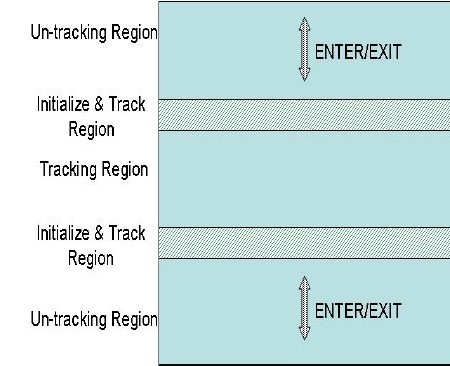

*Figure 1: Seat Availability Design - Virtual Lines*

**Development Languages and Software: **

The development of the seat availability took various forms and as development began our initial plan changed.

**Python: **

We used python because when we were doing research for counting people, we found that it will be easy to use python as counting people has been done in different fields earlier such as in shopping centres, Universities, etc. We can use that coding and make changes and can use for our project.

**Camlytics Software: **

After developing code in python, we did not get the result we want as it was not accurate and sometimes it does not work in the congested area. So we decided to use Camlytics which operates on the similar algorithm and concept of people count.

We also want to connect our software of counting seats to the database server so the passengers can see the availability of seats on the mobile application which we have created. The process on how the software will connect to mobile application is shown in figure x.

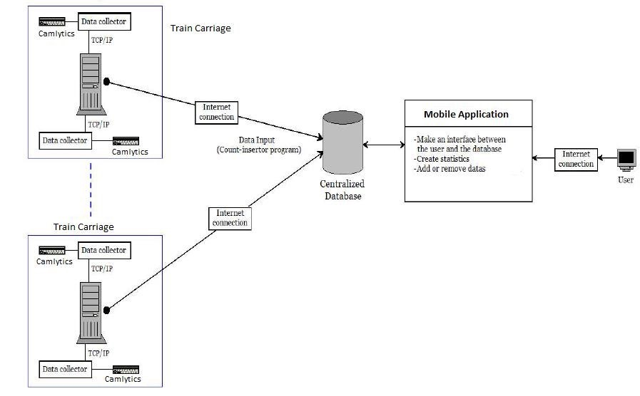

*Figure 2: Seat Availability - Connection between Mobile App & Software Camlytics*

**Testing: **

Testing played an essential role in the development of the seat availability. Due to encountering a lot of problems such as not getting an accurate count in congested areas or peak hours testing and fixing the wrong part was necessary for us. After progressing on each section, we decided to experiment its functionality before moving on to make sure we get accurate data.

### Wireless 

<a href="http://www.youtube.com/watch?feature=player_embedded&v=kZW83SSdRuc
" target="_blank"></a>

Our wireless section did not require any development of a prototype unlike other modules however our research will be presented in this section. We began by researching on how to implement the wireless concept onto public transportation services and the benefits it would provide the passenger. Our concept of providing LAN entertainment allowed us to conduct research into the software and hardware requirements as well the design requirements to make such a concept feasible. Our development process began by identifying in-scope and out of scope items for the concept. At the same time, we also developed a Gantt chart so we would follow the chart to ensures that every single step is done within the timeframe. As a result, the whole project is completed on time. During our research, we gather some information from companies that had planned to implement the idea. We then modified the concept, so it fits into what we planned to achieve. As for the network topology, we used the picture from Transport Sydney Train website then identify the position for placing each network devices so that the best connectivity is achieved. Lastly, we have considered technical reports on how to construct a proper report so that our concept of building a wireless technology on trains could be explained accordingly.

For our research into hardware please refer to the hardware overview section in the appendix of the report where we have provided the hardware requirements for such a project. Below we have specified the software overview and what would be required to make the concept a reality. 

### Software Overview 

**File sharing system **

**Why window file sharing?**

Two reasons to use window file sharing could be transparent caching and background synchronization. With transparent caching, it improves on the time required for a user to access files for the next consecutive time. When a user access files from a server for the first time, window stores it in its cache on the local disk. So, when the user tries to read the same files again, window retrieve it from the local disk instead of reading from the server. Which as a result reduce the time required when a slow network is encountered? With background synchronization, it is a transparent system, it allows a user to update files even if they are offline or encounter slow network. When a user is offline, the update files are cached on client computer's disk which will be synchronized automatically when a user goes online. By using the shared folder synchronization, it allows users to gain access to files in the shared folder even if they are offline.

**Why not Linux network file system (NFS)?**

One of the disadvantages of the Linux NFS is the security issue. NFS is based on remote procedure calls(RPC), so it should be used in a trusted network where there is a strong firewall build up. If security on NFS is not setup properly, two types of attacks will occur such as eavesdropping and impostor attack. Where eavesdropping results in a hacker picking up unauthorized data as it transfers between the network. An impostor attack refers to an impostor gain access to the network unauthorized. Therefore, a hacker who manages to hack into the network will be able to steal files, modify and read any document. Another disadvantage is the performance limitation. When there are too many users access through NFS, the network traffic starts to increase and as a result, performance will be slow down. **File sharing software **

#### OPlayer 

The software that we would like to introduce for the file sharing between client and NAS is called OPlayer. Below we will list out some of the key features and basic functions of OPlayer (OPlayer Lite - media player, video file manager version 3.3 2016).

#### Key features 

-   It supports a different kind of file sharing between a client and a server, such as SAMBA, FTP, DLNA, and HTTP. With different application protocols available for used, it would allow network technician to upgrade or change the protocol when it is needed to ensure the best performance.

-   Privacy support: It enables technicians to lock sensitive document within the server. When users access the server, the sensitive documents or folders will require a password to access it.

-   Play files remotely: It allows users to stream a media files without having to download it. This would then help users to conserve their mobile phone data by using the FTP that we have set up.

#### Basic functions 

-   Support wide range of text file: With the wide variety of text file support, such as TXT, WORD, PPT, and PDF, users will be able to read books, articles or news in a different format.

-   Support NAS, Router, Dropbox, network storage: This is one of the main function that we are considering. As we are planning to build a NAS to store media, we would then require a software that can be connected to NAS easily without having a difficulty setting.

-   Other functions: File manager, customise playlist, compress or decompress, photo viewer, and much more.

Besides the features and functions, we researched this application on both apple and android store. This application has been in the stores for more than six years. Within this six years, there were tons of improvement have been made according to the review. Although there were some bad reviews about how the system crash out of sudden, does not provide stable connection, and poor interface, most of the reviews have been positive and it has been rated as \"iPhone Apps Plus Best\".

## Experimental Results & Discussion 

This section of report looks at the experimental results conducted for each of the different modules that we mentioned throughout the report. This section looks at experimental results and discusses the implication of them.

### Experimental Results for Wireless 

Due to this module of wireless networks on the train being purely theoretical and no experimental results were required. We have provided a overview of how the wireless will work and mentioned a real world case study were a similar concept was published.

#### How wireless work 

Introducing wireless function of our project, as we discussed in the previous parts of our project, we have decided to use NAS, routers, switches and access points to meet our initial requirements.

The core part (Figure 1) contains a NAS, a router and one switch. NAS stores media and forward data packets in the local network through our router. The switch provides more ports for our access point since we do not have enough one on our router.


*Figure 1: Core part*

On each carriage of the train, we equipped the access point that forwards entertainment files to users. (Figure 2) All access points were set up as a same SSID name channel and encryption which allows user can hand-off on the train. A User simply connects to the wi-fi and use O-player to access our prepared media files in the NAS.


*Figure 2: Railway carriage*

In the section where we were introducing file sharing system, we have already discussed how windows 10 file sharing system takes advantages than others. In addition, windows 10 supports various types of files due to it was built for public, therefore, it allows us to manage media files more efficiently. To configure windows sharing that allows passengers can access our media files, the public folder sharing section should be turned on (see figure 3) and make sure our NAS has assigned a static IP since we do not want to see the linked between passengers' devices and NAS will be broken due to a dynamic IP address. Regarding user-friendly, we would like to stick a note of the instruction along with a static IP of our NAS to help passengers use our WI-FI service.

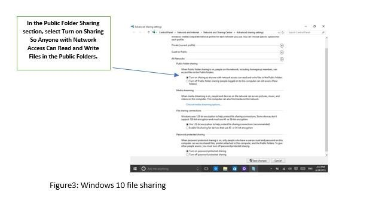

Introducing O-player which is the ios app that supports file sharing between client and NAS. In the section 5.2, we already discuss the key features of this app. The idea of better explanation for how we implement it as our main app in our project, see the instruction which we will stick it on the back of the seat below.

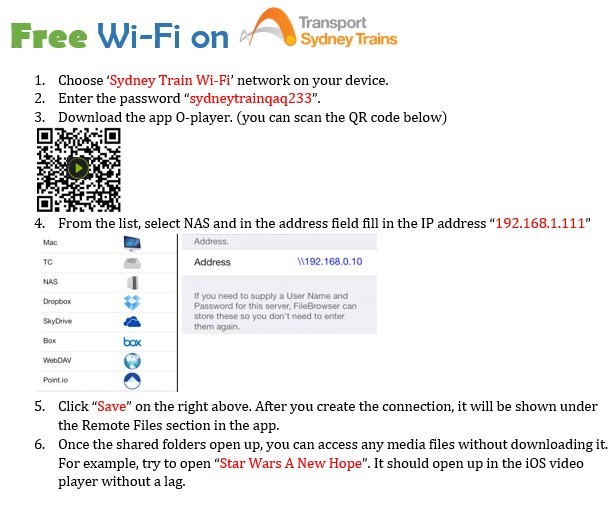

### Real World Example - Current entertainment 

According to Lancefield(2016), Virgin trains in the UK started using a similar to Netflix entertainment system which allows customers to watch film or TV programmes using their own smart devices. For customers to enjoy their on-train entertainment, they must use an application via an onboard server.

The above in train technology is like what our team plan to implement on NSW train service. In our theoretical implementation, we have included other source of entertainment such as music, newspaper, and book. Both ideas require a customer to have their own smart device to access to the in-train server through the application for real-time streaming.

The idea of (Train Design 2002) is to provide a similar entertainment as what we currently have on a flight. A VGA-resolution seat screen located on customer\'s seat and a customer will be able to stream entertainment that was stored in the system. However, the idea has been delayed due to two factors. First, the proposed idea was attractive, but there is no one could prove how well is the actual system with a qualified device. Second, the system that (Train Design 2002) planned to implement is costly as they planned to use the in-flight entertainment system.

In our design, we recommend the use of customer\'s smart device for streaming entertainment. With our solution, some customer would be able to use a bigger screen to watch movies and at the same time save cost on purchasing screen. The cost of purchasing screen can be spent on improving the connectivity.

### Experimental Results for Seat Availability / People Counter 

During development process for seat availability we have done multiple experiments before coming to the final decision of what we think is suitable for this project.

First, we started with research of an algorithm that counts the number of people. We can also select sensors for counting people, but we think live videos will be a better choice as for sensors we were not getting an accurate count as sensors cannot differentiate between humans and objects. By using cameras, algorithms, and codes, we get an accurate count of people. We try to build different algorithms and also made flowchart on it about how the algorithm will work. We made a system overview of the project on how the algorithm will work as shown in figure x.

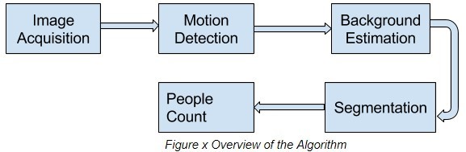

After building an algorithm we started working on the design of the system on how it will work, what type of equipment we will need and how much it will cost. We decided to use existing camera on the Sydney trains and install our algorithm in that so it will be easy for us as we can save money and can help Sydney transportation by giving people how many idle seats are available in a carriage. Camera position will be like as shown in figure x. and the system will work as shown in figure x

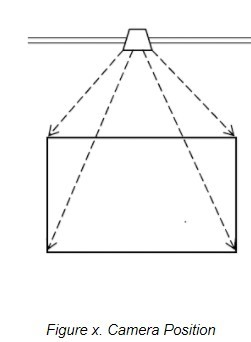

We did not get much success with our algorithm, so we made tiny changes in the algorithm and started working on coding for our system. As most of our group members just have a basic knowledge of python coding, it was difficult to get the accurate coding. We got help from the internet while searching for more information about python we found a program called OpenCV(open source computer vision) which is a library of different programming functions mainly aimed for real-time applications. We choose openCV because the library is cross-platform that means it supports various programming languages and it is free to use under the BSD license. We started building the code for our system with python and openCV as shown in Appendix X. We successfully build and tested the code for face detection but for counting people in congested places it did not succeed as our expectations. So, we started working on our script again made few changes and test the new code this time it did work for counting people, but we did not get the accurate results as our script was also counting background object as well with the humans.

At last, we found a software called Camlytics. It is a camera management, recording and video analysis tool, that has the wide variety of applications such as it can be used for safety purposes in Sydney transportation not just by recording with the camera, but also by applying advanced video analysis instruments. Camlytics also allow us to record and have a track of the wide range of situations - such as we can detect objects, we can know which specific direction is the object moving, and the most important thing for our project counting people. It also allows us to collect statistics about on which time the train station is the busiest and to build heat and trajectory maps for each camera, that can be extremely useful for Transportation.

This tool works on the similar algorithm and code as we developed but did not get it to work accurately. With this software, we are getting an accurate count of people. So, we decided to use Camlytics for our project.

Accuracy was the most significant concern for us when we started working on this project. When we were comparing our data of counting passengers manually, and with the software Camlytics we got a pretty good result of 98% accurate data. The table below shows the result we got by counting manually and with the program Camlytics.


### Experimental Results for Mobile Application 

During the development of the mobile application the use of iterative agile development meant that we could experiment on different ideas and concepts and attempt to see if they could be achieved. Below we have mentioned some of the experimental ideas and results.

#### Wireless  

The ability to provide information on the wireless access points we experimented with different ideas. It began by identifying the best way in which we could retrieve Wi-Fi information from the device. The device we were using a MacBook and our focus was to identify some Linux commands that could be run to achieve this.

Our finding found that using the command "airport --s" within the terminal would result in scanning the entire network for wireless access points. This information would then be displayed within the terminal. Then using "airport --s \>\>name.txt" allowed us to save the output of the terminal into a text file which we could then copy into the required server directory. This file could then be read in and displayed onto the user's browser. To make this process more efficient we wrote a Python script that would complete the required terminal commands as well as copy the file into the required directory. This would allow us to quickly scan and display the Wi-Fi access points without having to copy and edit files on the fly. This is how our application currently scans for network devices however, we attempted another solution as discussed below.

We attempted to experiment with the use PHP to execute shell commands instead of using the Python script. This would then allow us to create a button to execute the PHP script that would allow for the automatic execution of required code. The PHP "shell\_exec" was experimented with to try and make this solution a viable. However, there were several problems that such as permission issues which prevented us being able to achieve this goal. The combination of permission issues and time constraints did not allow us to be able to successfully create a PHP script which could execute the required commands.

The second area in which we attempted to implement a solution for the network access was the use of network information API. The network information API is designed to provide general connection information types and more. The network information API could be used to identify network interfaces and the connections. This could have been a suitable solution for the API for our mobile application. However, after further research and attempting to test and online demo we determined that it was not feasible to implement this network information API. The API would be designed to provide scripts notification when network connection types had changed which would not be suitable for our mobile application.

#### Server  

Having the ability to run the application on a server is a future goal we are aiming to provide for the application. During the development of this project we went through multiple experiments to get this running on an Ubuntu server. This was the original idea at the start of the development cycle to have the application running directly off the server. Due to changes of programming languages meaning we had to change the software and services we used to develop the application we decided not use the server at this moment. Even though this was the case we still experimented on how we could get the server up and running for the future.

Our findings of being able to run the application on the server while also being able to retrieve data from the SQL database (which was also going to be stored on the server) was to use Microsoft Azure. Unfortunately, this idea became useless due to the hardware of the server as this service required a very heavy system with expensive hardware capabilities which our Digital Ocean server didn't have the hardware capabilities.

Further experimentation was actioned where we found another service called MySQL which we tried installing on the Ubuntu server. This would allow us to develop the database within the CLI which we could use to extract data from within the Web Application. Although this also didn't work as it also required hardware capabilities such as 4GB of RAM which was too much for the 512MB-1GB of RAM the Digital Ocean server could hold.

Another additional experimentation was produced on the server by trying to install the software required to run the MyPHPadmin service. Running this service seems to be very promising as it's already running on a MacBook laptop that is currently running the Web Application. Being able to install this on the server will then allow us to move all the data from the MacBook to the server where we can then make configurations to allow it to be accessed. Although further experimentation is required here before it'll be safe to complete this transition.

## Quality 

This section of the report looks at the quality of all the different modules of the project.

### Seat Availability 

While the evaluation demonstrates the adaptability of the people counting algorithm to various movement patterns, it reveals several open problems. We found a lot of methodologies, algorithms, approaches or framework works available in the field of crowd (people) counting systems is still required for the robust system which should handle the following scenarios with a single structure: massive crowd, both static and dynamic crowd counting, it should work in all kind of environments, less Computational cost and time. Therefore, efficient people counting is useful in many ways one such example is the project we have done which is to ensure the security and safety of passengers in transportation, resource allocation for public events. If we had more time and resources or what could we have done better is that we would have overcome the issues like the ambiguous appearance of body parts, background objects, we need a robust method for extracting the people count.

### Wireless 

The idea of our project which directs to the wireless functionality part which has successfully implemented the local area network on the train, and allows passengers to access our media files theoretically through a NAS and a couple of physical devices and software's. By completing this project, we successfully solve the problem that passengers complained about no Wi-Fi on the train and help passengers save their mobile data plans. Speaking of reflection, the thing that we want to improve in the future is implementation since the connection between each carriage of the train is still theoretical, we have planned to deploy devices on the Sydney train with the government authority to see the performance between trains are moving and stopping. In addition, if the future technology allowed and performed better, we would like to add mobile network which includes 4G or 5G to provide a better service for our passengers.

#### Possible Improvement 

As technology advanced, people are seeking ways to bring technology into their daily life to enhance their working experience or improve their lifestyle. We have noticed many people are using their smart devices to watch movies, read books or listen to music. We then try to bring the benefits of the smart devices into NSW train service to allow extra entertainment when people travel across different state or travel a long journey. As for the current NSW train service, there is no other entertainment than playing with their own smart devices. After researching, we planned to develop extra entertainment such as movies, music, books or online newspaper to public users when they travel by NSW train service. Firstly, we will be implementing a self-developed network attached storage (NAS) in the middle cabin of a train. Secondly, router and switch will act as a connection between the server and access point from another cabin. For the router, it will be developed to produce an FTP connection between smart devices and server. A user with smart devices will be able to use the FTP network address to connect to the server for searching media. A switch is utilised for the connection between the access point and router. Thirdly, every cabin will have an access point install for connection to the switch in the middle cabin.

### Mobile Application 

We believe the Opal web application we have developed contains many quality features that make the application to be very helpful while having all required needs accessed through one location. The main reason we believe the application is at a high quality is that users can now access all their previous opal functions from within this new application due to the Opal website link. Further quality can be seen from the inclusion of improvements such the trip planner added to the application; adding this function allows the user to not need another application to view the train timetable such i.e. TripView.

Even though this application has some great quality attributes to it, many improvements can be implemented to increase the overall quality. One feature that can be improved is how the trip planner is currently being used, especially when comparing it to how it works on the TripView application. The biggest improvement that can be implemented is the ability to save train trips. Doing this will make it easier for the user due to not having to input the train's each time, especially on trips that a user will use all the time, such as a trip to work. Another improvement that can be implemented to improve the overall quality of the application is improving the user interface of the web application. For the development of this application we didn't focus on visual design due as much, this would be a good element to improve on.

## Depth Reflection 

#### Johnathan Khoury 

I had previously never built a web application, furthermore I had also never used PHP to develop any application. We originally wanted to develop the web application with HTML and JavaScript due to gaining knowledge of these in previous subjects, although there was some difficulty in developing the web application so Manraj and I decided to research further into the web application development and decided to use PHP.

Doing this had also made me learn a complete new programming language which I had previously not had much knowledge with. SQL on the other hand I had completed a subject at University called database fundamentals that taught me how to retrieve data from tables, although I had further improved my knowledge within this area such as learning how to retrieve data from tables that don't have empty data within them. Using both these languages in cooperation with each other has also improved my knowledge on how they can interact with each other and retrieve data to be displayed on the screen. Such as how PHP is used to connect to the SQL server which then can retrieve data through an SQL query (either with or without user input), where this data can then be displayed to the user within the web application.

A problem that we encountered during the development on the application was inefficient code due to not having too much knowledge with PHP as stated above. My goal for future projects would be to improve on simplifying the code and making it as readable as possible to allow others or myself to be able to edit or change code if required.

Group member communication was very frequent within the group, which everyone was nearly able to turn up the weekly group meetings each week to discuss what we had done. I had found these to be helpful in most weeks due to being able to ask my supervisor questions about the development process of the web application, where I was able to retrieve feedback on how we could improve the application or what is not required for the application.

#### Manraj Sangha  

I believe that the project was a successful one. The reason I think this is because the goal of our project is to provide research and a demonstration of additional services and functionality that could be implemented on Australian transportation services. I believe that this core goal was accomplished.

The experience of the project taught me new skills and developed upon existing ones. The project allowed me to develop my programming skills and have a greater understanding of two new programming languages (PHP & Python). My strengths lie within networking however, I believe the addition of enhanced understanding in the two mentioned languages will allow me to transition into both the workforce and into my strength networking. I also have a greater understanding of different wireless and the different monitoring tools that can be used to manage large public spaces.

Furthermore, the experience of working within a team to accomplish the same goal was one which allowed me to understand the importance of coordination and communication amongst team member. Communication and team management are important skills that I believe will allow me to translate over into the work force. I also learned the importance of setting agendas for team meeting and setting milestones throughout the project. Without these two team meetings are often extremely unproductive and without milestones to achieve throughout the project it is easy to become off-track.

Improvements I would make next time is better time management of the project and clearer milestones. Although we had a Gantt chart which we followed throughout the project clearer milestones of what should have been completed at what points would have also helped with the project. I would have also built in a contingency into the Gantt chart if aspects of the project overrun or did not go according to plan.

Group member\'s contribution was good and attendance to team meetings was consistent. Our supervisor was extremely helpful in setting expectation and assisting in pointing us in the right direction when or if we were going off-track. Furthermore, our supervisor provided valuable resources which helped during the development phases for both our people monitoring / seat availability and the mobile application.

#### Rong Quan Yau  

Through this project, I have gained extra knowledge on NAS device after researching and consulted from my member\'s uncle on how can we build a NAS device for our project. Not only that, but this project also helps me make use of the previous knowledge that I have learned from the university such as Project Management for the Professional in assisting me on structuring the report, networking subjects in determining what devices are required for building this concept. Researching is also another challenging for us as we have to research on how to self-build a NAS which also includes a budget, so we have an estimation on how much it costs. This is one of the beneficial and challenging subjects which it allows students to self-learn extra knowledge.

If there is another chance for doing this project, I will choose to challenge myself to build the LAN network on the train and develop our own software to run the entertainment on passenger\'s smart devices. By doing so, we would be able to maintain the software and NAS easily and ensure the software meet our expectations on meeting passengers demand.

#### Yunpeng Yi  

During this development of the project, I have learnt the importance of the group work about planning and discussing. I also have a deep understanding of network protocols and hardware and software. The technology behind popular device Sysnolgy NAS was learnt and implemented so well during the period of project development. What I want more is to implement 5G technology into our project to provide a better service for our customers.

#### Ashit Hemani  

To write and develop code in python was challenging for me as I have less experience in that programming language which I had completed a subject at University called Fundamental of Security. I do have experience in other programming languages like HTML, Java, etc. but the code we want to build and will only work with python. As I have some knowledge of different programming language, It was quite easy to learn python after doing some research and try to learn about it as it was somewhat similar to other programming languages.

While developing the code for seat availability, I also learn about new programming libraries which is OpenCV. If we compare python to other languages like C/C++, Python is slower. Python can be easily prolonged with C/C++, and this helps me to write codes in C/C++, and I can create a Python wrapper for it, and I can use those wrappers as Python modules. This gives me a couple of advantages: firstly, our code was fast and second, it is very straightforward to code in Python. I also learn about Numpy which makes the task more comfortable for me as it is a highly optimized library for numerical operations so we can get people count. It gives a MATLAB-style syntax. All the OpenCV array structures are converted to-and-from Numpy arrays

Our supervisor was very helpful as I can ask my supervisor about the seat availability process and can work on the process further from the feedback. We also have weekly group meeting so we can talk to each other about what they have done each week and can give feedback to them.

#### Lahiru Yapa

I found this project interesting and challenging which I really enjoyed. This project also exposed me to how a real project works.

If we had to do this project again I would do it differently like instead of trying to build the program myself I would find a software that already exists.

## Challenges 

During the progress of our report we did encounter several challenges that had some sort of impact on the project. As mentioned in previous sections our project is composed of three modules which build up the entire end solutions. This section provides challenges for each of the modules as each module area encountered a different challenge.

### Mobile App  

#### 1. Inexperience programming skills and knowledge  

The lack of experience and knowledge in programming posed a major challenge on the development of the mobile application. Individuals within the group had minimal programming skills and as a result creating and development of the mobile app took longer than expected. In addition, to increase the time for development the lack of knowledge lead to a lot of research and self-learning of different languages to make the programme a successful one. For example, PHP and Python Programming which was required for the development of the mobile application was learned during the development of the mobile application. This lack of programming skills also leads to the use of inefficient code and module making it difficult to scale the application in the future. It also meant that additional time was taken going back and correcting inefficient code.

#### 2. Compilation Issues  

PHP as well as Python gave us some compilation issues especially when building PHP files to read and execute queries in the SQL database. This involved correcting the syntax and attempting to execute the PHP code. Python had a few but minimal compilation errors however most of these we overcame by researching some of the common compilation errors.

#### 3. Scope  

During the development of the mobile application we underestimated the actual size of the scope for the project. Although at the beginning of the project the scope did not seem too significant. It was later in the development phases where the combination of time constraints and a large scope posed major challenge. This ultimately resulted in us prioritising the most crucial parts of the application and attempting to fulfil those parts. As a result, this meant parts of the scope was not successfully fulfilled.

#### 4. Time Constraints  

Completing the mobile application within the specified time frame was a big challenge. Time management for this project was key and contingency for lack of knowledge or time to build the database was not considered early in the project. Building of the login system and the errors and research required to develop the PHP code was extremely time consuming. Time was also taken to learn basic PHP and Python programming was much more time-consuming process. The time to better understand and gain the knowledge was subject to the speed in which the developers could learn the languages.

#### 5. Inefficient way of development  

The using of PHP and HTML code to develop our application was not the most efficient way to build the application. The web development which would be optimised for mobile application use was not the most efficient way to develop the application. A dedicated mobile application which could be run on mobile devices such as iPhone would be a more efficient way of development.

#### 6. Selecting the right programming languages 

We originally wanted to strictly create the web application with HTML and JavaScript, although we ran into multiple problems of getting everything to output correctly due to not having enough knowledge in embedding Java into HTML. The main problem we faced on using only both these languages is that we were unable to store data and output the correct data from the user's input.

#### 7. Conversion of Database to Web Application 

Another Challenge we encountered was converting the Database that we are creating in Microsoft

Access to a Web Application using Microsoft SharePoint. Unfortunately, this was not possible due to the Office 365 student license offered by UTS. When we decided to embed SQL into the program this was the original idea of getting the program to function, meaning we had to make many changes to continue to get the database up and running.

#### 8. Using the User's input to display an Output 

When we first decided to create a Train Timetable web application, the idea was to make the user input the starting and destination train stations which would depict the times each train will arrive at each station. We encountered problems of creating a SQL query to display these times, which we reached a point of just creating the tables in Microsoft Access and exporting them as a HTML file which would display the train times from the input by the user, although this was not required for the product of the Web Application.

### Wireless  

#### 1. Device requirement 

We had come across many network storage devices but they were either costly or some functions are not needed. So, we have decided to build a network storage for our concept, this will then require us to spend more time researching on how to build a network storage.

#### 2. Similar concept 

Supervisor suggested us to compare our concept with the existing one if there is a similar concept being developed or already exist. It was not difficult in finding a similar concept, but the difficulty lies in we must have to make a comparison between the two.

#### 3. Software requirement 

As for the software to be used to on passenger\'s smart device for access to the server, there are many similar file-sharing software available. We are unsure of which software would be best for our concept so we must research on many different software before finalising the software to be used.

### People Counter / Seat Availability 

1.  **Coding Python Skills -** Limited programming skills for the language Python. The challenges we faced was the development of code which would allow us to track the individual or person who enters or leaves a frame of the shot.

2.  **Time Constraints -** Due to time constraints developing the entire program to count people entering and leaving an area from scratch was infeasible.

## Solution to Challenges 

This section looks at the potential solutions to the challenges mentioned in the previous section. This has also been broken down into the different modules.

### Mobile App 

#### 1. Inexperience programming skills and knowledge - 

The challenge of being inexperienced and not having the correct knowledge required for the development of the mobile application could have been overcome by improving our preparation for the project. During the research and initial planning phases of the project better identifying and learning the required skills for the project before development would have assisted in overcoming this challenge.

#### 2. Compilation Issues - 

One possible solution to this challenge is having a better understanding of the programming and development language. The solution to this challenge links into the previous point and better learning of the language could have helped fix common compilation issues. Completing full courses provided by the Uni or on Lynda.com prior to development would have assisted in reducing the challenges faced with compilation.

#### 3. Scope  

A solution to the large scope is to narrow down the scope to be focused on a specific functionality of the mobile application. Another solution to this challenge could have been conducting further research into the different scoping areas to better understanding if they would fit within allocated time frame of the project.

#### 4. Time Constraints  

The only solution to the challenge of time constraints is better time management during the initial planning phases of the project. Having a greater understanding and better planning for the development phase to allow sufficient allocation would have reduced this challenge to a minimal. Building in contingency within the planning phase would have limited the pressure to meet the deadlines when crucial time would be taken learning the programming language required for development.

#### 5. Inefficient Development  

One solution to the challenge faced with developing in a web page and scaling to mobile is by starting and preparing the project to be developed as a fully functional mobile application. However, this could have presented its own challenges by using this method.

#### 6. Selecting the right programming languages 

Our solution was to implement SQL and PHP into the Web Application while continuing to use HTML, we ended up removing Java completely. This allowed us to create a SQL database that could run queries with the implementation of PHP. Doing this allowed the us to get the login process to function correctly, while also being able to create the tables for the timetable.

#### 7. Conversion of Database to Web Application 

Since the original idea of using Microsoft Access to create the Database then converting it into a Web Application was no longer an option we decided to use MyPHPadmin. This allowed us to transfer our database tables from Access to MyPHPadmin with its great upload function. Once we had successfully transferred the tables into MyPHPadmin we were able to use its data by using PHP to retrieve it so it could be displayed in the Web Application.

#### 8. Using the User's input to display an Output 

WE continued to research into how to make the program display the required out from the user\'s input, which we came across a way through a specific SQL query. Due to the table having empty slots within it, we had to create a query which will only display the rows that have the values on the selected train stations. This could be achieved by using the following query (SELECT TABLE WHERE COLUMN1 \<\> '' AND COLUMN2 \<\> ''), where this will ignore all rows where COLUMN1 and COLUMN2 are found empty.

## Statement of Contribution  

#### Johnathan Khoury 

-   Performed research into how to develop the web application in relation to what programming languages we would select.

-   Built a variety of HTML web pages that were used in the Web Application such as the starting and destination pages.

-   Gathered data for the trip planner trains and times.

-   Built the Trip Planner database tables that were used to collect data from.

-   Created the PHP template that was used to retrieve data from the SQL tables.

-   Created SQL query that would be used in correspondent to the PHP code that would extract the data from the tables.

-   Created all the SQL queries for each station to retrieve the required data (this was scraped due to a better solution).

-   Created CSS templates for the design that would be used for most of the web pages.

-   Tested all features were functioning correctly after the development of the web application.

-   Built the Ubuntu server and experimented how it could be used to run the web application.

-   Filled out tracking/log book documentation each week.

-   Created the Gantt chart layout that would be used by all group members, while creating the Gantt chart for the Mobile Web Application.

-   Contributed to the documentation of Assessment Task 2: requirements, specification and planning phase and Assessment Task 3: mid project review.

-   Contributed to the documentation of Assessment Task 4: Final report, specifically on the project development process, experimental and results, challenges, solution of challenges, and source code.

#### Manraj Sangha 

-   Group leader -- managed the group and answered questions whenever needed to help the progression of the project.

-   Performed research into how to develop the web application in relation to what programming languages we would select.

-   Developed the 'Home' web application HTML page that connects all the features such as login, trip planner, opal website link, and wireless.

-   Developed the login feature for the web application.

-   Created the MyPHPadmin server used to store the database.

-   Created the PHP template that was used to retrieve data from the SQL tables.

-   Created links for buttons used in the Web application.

-   Worked on improving the input system of the user for the trip planner.

-   Tested all features were functioning correctly after the development of the web application.

-   Filled out tracking/log book documentation each week.

-   Contributed to the documentation of Assessment Task 2: requirements, specification and planning phase and Assessment Task 3: mid project review.

-   Contributed to the documentation of Assessment Task 4: Final report, specifically on project development process, experimental and results, challenges, solution of challenges, and source code.

-   Re-compiled all written assessment tasks for final submission.

#### Ashit Hemani

-   Researched and designed the algorithm for the seat availability.

-   Created and tested various algorithm for seat availability.

-   Learned python programming for this project.

-   Built a code in python for face detection and to identify humans.

-   Developed a script for counting people in python.

-   Tested all the features of the code in the real environment.

-   Found and study a software called Camlytics for counting people and tested the software.

-   Filled out the logbook document every week.

-   Created the Gantt chart for seat availability so we can be on the right track every week.

-   Contributed to the documentation of Assessment Task 2: requirements, specification, and planning phase and Assessment Task 3: mid-project review.

-   Contributed to the documentation of Assessment Task 4: Final report, specifically on Comprehensive review, project development process, experimental and results, quality and depth-reflection and the source code.

#### Lahiru Yapa

-   Had an attempted at doing the Project development process for seat availability

-   Wrote up Challenges for Seat Availability

-   Wrote up the solution to the challenges for seat availability

#### Yunpeng Yi 

-   Researching hardware parts of wireless functions which includes o Existing device o Our device(Self-build)

-   NAS technology and decided of building our NAS instead of buying a manufacturer one

-   Possible improvement on the train service.

-   Budget table and how wireless work section.

-   Designing the instruction of wireless which will be put on the train.

-   Improve all the sections where we figure out where and how we can improve on.

-   Equally contribution to assessment 2 and 3

#### Rong Quan Yau 

-   Focused on the massive research area of the software parts of wireless function o File sharing methodology o Operating system choosing

-   Designed the network topology.

-   Comparing and deciding the app that we are going to use for passengers.

-   Research on the concept of current entertainment that was served on trains

-   Suggested a few ideas to the problem that others faced which could be improved • Equally contribution to assessment 2 and 3

## Bibliography - 

Below we have specified a complete reference list in UTS Harvard referencing format.

1.  Stackoverflow, 2011, *Click a "button" in an HTML page will direct the user to another HTML page, and make a "hidden div" in that other page shows with JQuery".* viewed 9th October, 2017*, \<[[https://stackoverflow.com/questions/6640980/click-a-button-in-an-html-page-willdirect-the-user-to-another-html-page-and]{.underline}\>](https://stackoverflow.com/questions/6640980/click-a-button-in-an-html-page-will-direct-the-user-to-another-html-page-and)*

2.  HTML Color Codes, n.d, *Get HTML color codes, Hex color codes, RGB and HSL values,* viewed 9th October, 2017, \<[[http://htmlcolorcodes.com/]{.underline}\>](http://htmlcolorcodes.com/)

3.  CodeWithAwa, n.d, *Admin and User Login in PHP and Mysql Database,* viewed 9th October 2017, \<[[https://codewithawa.com/posts/admin-and-user-login-in-php-and-mysql-database]{.underline}\>](https://codewithawa.com/posts/admin-and-user-login-in-php-and-mysql-database)

4.  CodeWithAva, n.d, *Complete user registration system using PHP and MySQL database,* viewed 9th October, 2017, \<[[https://codewithawa.com/posts/complete-user-registrationsystem-using-php-and-mysql-database]{.underline}\>](https://codewithawa.com/posts/complete-user-registration-system-using-php-and-mysql-database)

5.  GitHub, 30th May 2014, *node-wireless,* viewed 9th October 2017,

[\<[https://github.com/tlhunter/node-wireless]{.underline}\>](https://github.com/tlhunter/node-wireless)

6.  Unknown, n.d, *Network information API Sample,* viewed 9th October 2017,
 [\<[https://googlechrome.github.io/samples/network-information/]{.underline}\>](https://googlechrome.github.io/samples/network-information/)

7.  Google, May 23rd 2017, *Google API Client Libraries,* viewed 9th October 2017,

[\<[https://developers.google.com/api-client-library/javascript/start/start-js]{.underline}\>](https://developers.google.com/api-client-library/javascript/start/start-js)

8.  Stackoverflow, 2010, *Read data from text file PHP,* viewed 9th October 2017,

 [\<[https://stackoverflow.com/questions/2648726/read-data-from-text-file-php]{.underline}\>](https://stackoverflow.com/questions/2648726/read-data-from-text-file-php)

9. ServerFault, 2015, *Executing a python script through PHP button,* viewed 9th October 2017,[\<[https://serverfault.com/questions/679198/executing-a-python-script-through-php-button]{.underline}\>](https://serverfault.com/questions/679198/executing-a-python-script-through-php-button)

10. Stackoverflow, 2013, *Execute Python in a php script using shell\_exec(),* viewed 9th October 2017, \<[[https://stackoverflow.com/questions/18721066/execute-python-in-a-php-scriptusing-shell-exec]{.underline}\>](https://stackoverflow.com/questions/18721066/execute-python-in-a-php-script-using-shell-exec)

11. Stackoverflow, 2011, *PHP Shell\_exec() vs exec(),* viewed 9th October 2017,
     [\<[https://stackoverflow.com/questions/7093860/php-shell-exec-vs-exec]{.underline}\>](https://stackoverflow.com/questions/7093860/php-shell-exec-vs-exec)

12. Stackoverflow, 2013, *Execute python in a php script using shell\_exec(),* viewed 9^th^ October 2017 \< [[https://stackoverflow.com/questions/18721066/execute-python-in-a-php-scriptusing-shell-exec]{.underline}\>](https://stackoverflow.com/questions/18721066/execute-python-in-a-php-script-using-shell-exec)

13. Stackoverflow, 2012, *How can I run a linux command from a PHP script,* viewed 9^th^ October 2017, \< [[https://stackoverflow.com/questions/12830520/how-can-i-run-a-linux-commandfrom-a-php-script]{.underline}\>](https://stackoverflow.com/questions/12830520/how-can-i-run-a-linux-command-from-a-php-script)

14. Stackoverflow, 2010, *PHP shell\_exec() and sudo: must be setuid root,* viewed 9^th^ October 2017, \< [[https://stackoverflow.com/questions/2230391/php-shell-exec-and-sudo-must-besetuid-root]{.underline}\>](https://stackoverflow.com/questions/2230391/php-shell-exec-and-sudo-must-be-setuid-root)

15. Raspberry Pi, 2017, *How to run terminal command from php file,* StackExchange, viewed 9^th^ October 2017, \< [[https://raspberrypi.stackexchange.com/questions/60220/how-to-runterminal-command-from-php-file]{.underline}\>](https://raspberrypi.stackexchange.com/questions/60220/how-to-run-terminal-command-from-php-file)

16. PHP, n.d, *shell\_exec,* viewed 9^th^ October 2017, \< [[http://php.net/manual/en/function.shellexec.php]{.underline}\>](http://php.net/manual/en/function.shell-exec.php)

17. Unix & Linux, 2014, *php shell\_exec() permission on Linux Ubuntu,* viewed 9^th^ October 2017, \< https://unix.stackexchange.com/questions/115054/php-shell-exec-permission-on-linuxubuntu\>

18. MDN web docs, n.d, *Network information API,* viewed 9^th^ October 2017, \< [[https://developer.mozilla.org/en-US/docs/Web/API/Network\_Information\_API]{.underline}\>](https://developer.mozilla.org/en-US/docs/Web/API/Network_Information_API)

19. Lynda, 2017, *PHP with MySQL Essential Training: 1 The Basics,* Kevin Skoglund, viewed 9^th^

    October 2017, \< [[https://www.lynda.com/PHP-tutorials/PHP-MySQL-Essential-Training-1-]{.underline}](https://www.lynda.com/PHP-tutorials/PHP-MySQL-Essential-Training-1-Basics/587674-2.html)

    [[Basics/587674-2.html]{.underline}\>](https://www.lynda.com/PHP-tutorials/PHP-MySQL-Essential-Training-1-Basics/587674-2.html)

20. Lynda, 2013, *Learning Python,* viewed 9^th^ October 2017, \< [[https://www.lynda.com/Pythontutorials/Up-Running-Python/122467-2.html]{.underline}\>](https://www.lynda.com/Python-tutorials/Up-Running-Python/122467-2.html)

21. Stackoverflow, 2017, *Scale website to mobile devices,* viewed 9^th^ October 2017, \< [[https://stackoverflow.com/questions/41432759/scale-website-to-mobile-devices]{.underline}\>](https://stackoverflow.com/questions/41432759/scale-website-to-mobile-devices)

22. Stackoverflow, 2017, *Retrieve data from website in android app,* viewed 9^th^ October 2017 \< [[https://stackoverflow.com/questions/6761082/retrieve-data-from-website-in-android-app]{.underline}\>](https://stackoverflow.com/questions/6761082/retrieve-data-from-website-in-android-app)

23. Stackoverflow, 2012, *How can I force a site to scale to fix for mobile (Iphone android...),* viewed 9^th^ October 2017, \< [[https://stackoverflow.com/questions/8154505/how-can-i-forcea-site-to-scale-to-fix-for-mobile-iphone-android]{.underline}\>](https://stackoverflow.com/questions/8154505/how-can-i-force-a-site-to-scale-to-fix-for-mobile-iphone-android)

24. Stackoverflow, 2010, *Python Script execute commands in Terminal,* viewed 9^th^ October 2017, \< [[https://stackoverflow.com/questions/3730964/python-script-execute-commands-interminal]{.underline}\>](https://stackoverflow.com/questions/3730964/python-script-execute-commands-in-terminal)

25. Stackoverflow, 2015, *Execute Python script from PHP,* viewed 9^th^ October 2017, \< [[https://stackoverflow.com/questions/31811253/execute-python-script-from-php]{.underline}\>](https://stackoverflow.com/questions/31811253/execute-python-script-from-php)

26. HTML.net, n.d, *Lesson 15: Reading from a text file,* viewed 9^th^ October 2017, \< [[http://html.net/tutorials/php/lesson15.php]{.underline}\>](http://html.net/tutorials/php/lesson15.php)

27. OSXDaily, October 2015, *How to Disable System Integrity Protection (rootless) in Mac OSX,* viewed 9^th^ October 2017 \< [[http://osxdaily.com/2015/10/05/disable-rootless-systemintegrity-protection-mac-os-x/]{.underline}\>](http://osxdaily.com/2015/10/05/disable-rootless-system-integrity-protection-mac-os-x/)

28. OSXDaily, Feb 2012, *Find & Scan Wireless Network from the command line in Mac OSX,* viewed 9^th^ October 2017, \< [[http://osxdaily.com/2012/02/28/find-scan-wireless-networksfrom-the-command-line-in-mac-os-x/]{.underline}\>](http://osxdaily.com/2012/02/28/find-scan-wireless-networks-from-the-command-line-in-mac-os-x/)

29. AskUbuntu, 2014, *How do I save terminal output to a file?* viewed 9^th^ October 2017, \< [[https://askubuntu.com/questions/420981/how-do-i-save-terminal-output-to-a-file]{.underline}\>](https://askubuntu.com/questions/420981/how-do-i-save-terminal-output-to-a-file)

30. Ashish 2017, *How to access shared Windows folder on iPhone (iOS) over wifi*, viewed 27th September 2017, \<[[https://www.guidingtech.com/27119/access-shared-windows-iphoneios-wifi/]{.underline}\>](https://www.guidingtech.com/27119/access-shared-windows-iphone-ios-wifi/)

31. BackupChain, viewed 4th Sep 2017, \<[[http://backupchain.com/i/why-you-shouldnt-buy-anas-like-drobo-synology-buffalo-netgear-qnap]{.underline}\>](http://backupchain.com/i/why-you-shouldnt-buy-a-nas-like-drobo-synology-buffalo-netgear-qnap)

32. Bill K. 2010, *'OPlayer' for iOS Supports impressive list of media formats,* viewed 4th September 2017, \<[[https://www.cultofmac.com/55499/oplayer-for-ios-supports-impressivelist-of-media-formats/]{.underline}\>](https://www.cultofmac.com/55499/oplayer-for-ios-supports-impressive-list-of-media-formats/)

33. Gearbest, viewed 1st Sep 2017, \<[[https://goo.gl/36d27r]{.underline}\>](https://goo.gl/36d27r)

34. Lancefield, N. 2016, *Virgin trains to launch entertainment app for passengers*, independent, viewed 26 September 2017, \<[[http://www.independent.co.uk/travel/news-andadvice/virgin-trains-to-launch-beam-entertainment-app-for-passengers-a7066781.html]{.underline}\>](http://www.independent.co.uk/travel/news-and-advice/virgin-trains-to-launch-beam-entertainment-app-for-passengers-a7066781.html)

35. Microsoft, viewed 1st Sep 2017, \< [[https://goo.gl/S6tRKJ]{.underline}](https://goo.gl/S6tRKJ) \>

36. Mwave, viewed 1st Sep 2017, \<[[https://goo.gl/E1VGYk]{.underline}\>](https://goo.gl/E1VGYk)

37. Mwave, viewed 1st Sep 2017, \<[[https://goo.gl/L182X9]{.underline}\>](https://goo.gl/L182X9)

38. Mwave, viewed 3rd Sep 2017, \<[[https://www.mwave.com.au/product/evga-supernova-]{.underline}](https://www.mwave.com.au/product/evga-supernova-750w-g2-80-gold-modular-power-supply-ab58319#detailTabs=tabSpecifications)[[750w-g2-80-gold-modular-power-supply-ab58319\#detailTabs=tabSpecifications]{.underline}\>](https://www.mwave.com.au/product/evga-supernova-750w-g2-80-gold-modular-power-supply-ab58319#detailTabs=tabSpecifications)

39. Mwave, viewed 1st Sep 2017, \<[[https://www.mwave.com.au/product/samsung-850-evo250gb-25-sata-iii-ssd-mz75e250-ab59172]{.underline}\>](https://www.mwave.com.au/product/samsung-850-evo-250gb-25-sata-iii-ssd-mz75e250-ab59172)

40. Mwave, viewed 1st Sep 2017, \<[[https://www.mwave.com.au/product/wd-wd40efrx-4tb-red35-intellipower-sata3-nas-hard-drive-ab51412]{.underline}\>](https://www.mwave.com.au/product/wd-wd40efrx-4tb-red-35-intellipower-sata3-nas-hard-drive-ab51412)

41. Mwave, viewed 1st Sep 2017, \<[[https://www.mwave.com.au/product/windows-10-home-]{.underline}](https://www.mwave.com.au/product/windows-10-home-3264bit-usb-drive-ab64970#detailTabs=tabSpecifications)[[3264bit-usb-drive-ab64970\#detailTabs=tabSpecifications]{.underline}\>](https://www.mwave.com.au/product/windows-10-home-3264bit-usb-drive-ab64970#detailTabs=tabSpecifications)

42. Mwave, viewed 1st Sep 2017, \<[[https://www.mwave.com.au/product/ubiquiti-networksuapacpro-80211ac-dualradio-access-point-ab68773]{.underline}\>](https://www.mwave.com.au/product/ubiquiti-networks-uapacpro-80211ac-dualradio-access-point-ab68773)

43. Mwave, viewed 1st Sep 2017, \<[[http://www.mwave.com.au/product/netgear-nighthawkx4s-d7800-dualband-ac2600-wifi-vdsladsl-modem-router-nbn-ab67378]{.underline}\>](http://www.mwave.com.au/product/netgear-nighthawk-x4s-d7800-dualband-ac2600-wifi-vdsladsl-modem-router-nbn-ab67378)

44. Mwave, viewed 1st Sep 2017, [[ https://www.mwave.com.au/product/alogic-30m-blue-cat6network-cable-ab89326]{.underline} ](https://www.mwave.com.au/product/alogic-30m-blue-cat6-network-cable-ab89326)

45. OPlayer Lite - media player, video file manager version 3.3 2016, iOS application, Olimsoft, [\<[https://itunes.apple.com/us/app/oplayer-lite-media-player-video-filemanager/id385907472?mt=8\>]{.underline} ](https://itunes.apple.com/us/app/oplayer-lite-media-player-video-file-manager/id385907472?mt=8)

46. OPlayer version 2.1.01 2015, Andriod application, Olimsoft CO. LTD,
 [\<[https://play.google.com/store/apps/details?id=com.olimsoft.android.oplayer.pro&hl=en]{.underline}\>](https://play.google.com/store/apps/details?id=com.olimsoft.android.oplayer.pro&hl=en)

47. Thesisscientists, *Chapter 11: NFS & Debugging Technique*, viewed 2nd Sep 2017, [\<[https://goo.gl/ssVuj7]{.underline}](https://goo.gl/ssVuj7) \>

48. Train Design 2002, *Cairns Tilt Train will have at-seat video entertainment: an at-seat video entertainment system is part of a new concept for long distance rail travel in Queensland, *
*Australia,* International Railway Journal,
 [\<[http://go.galegroup.com/ps/i.do?p=EAIM&sw=w&u=uts&v=2.1&id=GALE%7CA83733334&i t=r&asid=8dff623a248b58d5f85fc4f846fb0366]{.underline}\>](http://go.galegroup.com/ps/i.do?p=EAIM&sw=w&u=uts&v=2.1&id=GALE%7CA83733334&it=r&asid=8dff623a248b58d5f85fc4f846fb0366)

49. Sorptec, viewed 1st Sep 2017, \<[[https://goo.gl/Xp9zaK]{.underline}\>](https://goo.gl/Xp9zaK)

50. Sheinin, S, 2002, 'Global Information Assurance Certification Paper', SANS Institute 20002002.

51. *GitHub* n.d., viewed 24 September 2017,
[\<[https://github.com/shantnu/FaceDetect/blob/master/face\_detect.py]{.underline}\>](https://github.com/shantnu/FaceDetect/blob/master/face_detect.py).

52. *GitHub* n.d., viewed 26 September 2017, [\<[https://github.com/shantnu/Webcam-FaceDetect/blob/master/webcam.py]{.underline}\>](https://github.com/shantnu/Webcam-Face-Detect/blob/master/webcam.py)

53. *GitHub* n.d., viewed 30 September 2017, [\<[https://github.com/LukashenkoEvgeniy/PeopleCounter/blob/master/PeopleCounterMain.py]{.underline}\>](https://github.com/LukashenkoEvgeniy/People-Counter/blob/master/PeopleCounterMain.py)

54. Tiwari, S. 2014, \'Face Recognition with Python, in Under 25 Lines of Code, *blog*, Shantnu
Tiwari weblog, Real Python ,viewed 24 September 2017, [\<[https://realpython.com/blog/python/face-recognition-with-python/]{.underline}\>](https://realpython.com/blog/python/face-recognition-with-python/)

55. Tiwari, S. 2014, \'Face Recognition with Python, in Under 25 Lines of Code, *blog*, Shantnu Tiwari weblog, Real Python ,viewed 26 September 2017,
[\<[https://realpython.com/blog/python/face-detection-in-python-using-a-webcam/]{.underline}\>](https://realpython.com/blog/python/face-detection-in-python-using-a-webcam/)

### Appendix 

The appendix of the report provides additional resources, research and code for our project.

#### Seat Availability / People Counter  

```python
import cv2 import sys 
 
# Get user supplied values imagePath = sys.argv[1] 
cascPath = "haarcascade_frontalface_default.xml" 
 
# Create the haar cascade 
faceCascade = cv2.CascadeClassifier(cascPath) 
 
# Read the image 
image = cv2.imread(imagePath) gray = cv2.cvtColor(image, cv2.COLOR_BGR2GRAY) 
 
# Detect faces in the image 
faces = faceCascade.detectMultiScale(    gray, 
   scaleFactor=1.1,    minNeighbors=5, 
   minSize=(30, 30), 
   flags = cv2.cv.CV_HAAR_SCALE_IMAGE 
) 
 
print("Found {0} faces!".format(len(faces))) 
 
# Draw a rectangle around the faces for (x, y, w, h) in faces: 
   cv2.rectangle(image, (x, y), (x+w, y+h), (0, 255, 0), 2) 
 
cv2.imshow("Faces found", image) cv2.waitKey(0) 

```

Appendix 1: source code - Face Recognition with Python, in Under 25 Lines of Code  

```python
import cv2 import sys 
 
cascPath = "haarcascade_frontalface_default.xml" faceCascade = cv2.CascadeClassifier(cascPath) 
 
video_capture = cv2.VideoCapture(0) 
 
while True: 
   # Capture frame-by-frame    ret, frame = video_capture.read() 
 
   gray = cv2.cvtColor(frame, cv2.COLOR_BGR2GRAY) 
 
   faces = faceCascade.detectMultiScale(        gray, 
       scaleFactor=1.1,        minNeighbors=5, 
       minSize=(30, 30), 
       flags=cv2.cv.CV_HAAR_SCALE_IMAGE 
   ) 
 
   # Draw a rectangle around the faces    for (x, y, w, h) in faces:        cv2.rectangle(frame, (x, y), (x+w, y+h), (0, 255, 0), 2) 
 
   # Display the resulting frame 
   cv2.imshow('Video', frame) 
 
   if cv2.waitKey(1) & 0xFF == ord('q'): 
       break 
 
# When everything is done, release the capture video_capture.release() 
cv2.destroyAllWindows() 

```

Appendix 2: source code - Face Detection in Python Using a Webcam	 

```python
import argparse import datetime import imutils import math import cv2 
import numpy as np 
 
width = 800 
 
textIn = 0 
textOut = 0 
 
def testIntersectionIn(x, y): 
 
   res = -450 * x + 400 * y + 157500    if((res >= -550) and  (res < 550)): 
       print (str(res))        return True 
   return False 
 
def testIntersectionOut(x, y):    res = -450 * x + 400 * y + 180000    if ((res >= -550) and (res <= 550)): 
       print (str(res)) 
       return True 
 
   return False 
 
camera = cv2.VideoCapture("test2.mp4") 
 
firstFrame = None 
 
# loop over the frames of the video while True: 
   # grab the current frame and initialize the occupied/unoccupied 
   # text 
   (grabbed, frame) = camera.read()    text = "Unoccupied" 
 
   # if the frame could not be grabbed, then we have reached the end 
   # of the video    if not grabbed: 
       break 
   # resize the frame, convert it to grayscale, and blur it 
   frame = imutils.resize(frame, width=width) 
   gray = cv2.cvtColor(frame, cv2.COLOR_BGR2GRAY)    gray = cv2.GaussianBlur(gray, (21, 21), 0) 
 
   # if the first frame is None, initialize it    if firstFrame is None:        firstFrame = gray        continue 
   # compute the absolute difference between the current frame and 
   # first frame 
   frameDelta = cv2.absdiff(firstFrame, gray)    thresh = cv2.threshold(frameDelta, 25, 255, cv2.THRESH_BINARY)[1] 
   # dilate the thresholded image to fill in holes, then find contours 
   # on thresholded image 
   thresh = cv2.dilate(thresh, None, iterations=2) 
   _, cnts, _ = cv2.findContours(thresh.copy(), cv2.RETR_EXTERNAL, cv2.CHAIN_APPROX_SIMPLE) 
   # loop over the contours    for c in cnts: 
       # if the contour is too small, ignore it        if cv2.contourArea(c) < 12000:            continue 
       # compute the bounding box for the contour, draw it on the frame,        # and update the text 
       (x, y, w, h) = cv2.boundingRect(c) 
       cv2.rectangle(frame, (x, y), (x + w, y + h), (0, 255, 0), 2) 
 
       cv2.line(frame, (width / 2, 0), (width, 450), (250, 0, 1), 2) #blue line 
       cv2.line(frame, (width / 2 - 50, 0), (width - 50, 450), (0, 0, 255), 2)#red line 
 
       rectagleCenterPont = ((x + x + w) /2, (y + y + h) /2)        cv2.circle(frame, rectagleCenterPont, 1, (0, 0, 255), 5) 
 
       if(testIntersectionIn((x + x + w) / 2, (y + y + h) / 2)): 
           textIn += 1 
 
       if(testIntersectionOut((x + x + w) / 2, (y + y + h) / 2)):            textOut += 1 
 
       # draw the text and timestamp on the frame 
 
       # show the frame and record if the user presses a key 
       # cv2.imshow("Thresh", thresh) 
       # cv2.imshow("Frame Delta", frameDelta) 

```

Appendix 3: source code - PeopleCounterMain.Py	 

#### Mobile Application – Code 

File Name: App.CSS 

```css
* { 
 	margin: 0px; 
 	padding: 0px; 
} 
body { 
 	font-size: 120%; 
 	background: #808080; 
} 
 
 
.header { 
 	width: 30%;  	margin: 50px auto 0px;  	color: white;  	background: #689052;  	text-align: center;  	border: 1px solid #000000;  	border-bottom: none;   	border-radius: 10px 10px 0px 0px; 
 	padding: 20px; 
} 
form, .content { 
 	width: 30%;  	margin: 0px auto;  	padding: 20px;  	border: 1px solid #00000qq;  	background: white; 
 	border-radius: 0px 0px 10px 10px; 
} 
.main-button { 
 	padding-left: 150px; 
 	margin: 10px 0px 10px 0px; 
} 
.btn { 
 	 width:40%;  	position: center;  	padding: 10px;  	font-size: 15px;  	color: white;  	background: #808080;  	border: 1px black; 
 	border-radius: 5px; 
 
} 
.btn1 { 
 	width:40%; 
 	position: center;  	padding: 10px; 
 	font-size: 15px;  	color: white;  	background: #000000;  	border: 1px black; 
 	border-radius: 5px; 
} 
.btn2 { 
 	width:40%; 
 	position: center;  	padding: 10px;  	font-size: 15px;  	color: white;  	background: #000000;  	border: 1px black; 
 	border-radius: 5px; 
} 

```

File Name: Create_User.PHP 

```php
<?php include('../functions.php') ?> 
<!DOCTYPE html> 
<html> 
<head> 
 	<title>Registration system PHP and MySQL - Create user</title> 
 	<link rel="stylesheet" type="text/css" href="../style.css"> 
 	<style> 
 	 	.header { 
 	 	 	background: #003366; 
 	 	} 
 	 	button[name=register_btn] { 
 	 	 	background: #003366; 
 	 	} 
 	</style> 
</head> 
<body> 
 	<div class="header"> 
 	 	<h2>Admin - create user</h2> 
 	</div> 
 	 
 	<form method="post" action="create_user.php"> 
 
 	 	<?php echo display_error(); ?> 
 
 	 	<div class="input-group"> 
 	 	 	<label>Username</label> 
 	 	 	<input type="text" name="username" value="<?php echo $username; 
?>"> 
 	 	</div> 
 	 	<div class="input-group"> 
 	 	 	<label>Email</label> 
 	 	 	<input type="email" name="email" value="<?php echo $email; ?>"> 
 	 	</div> 
 	 	<div class="input-group"> 
 	 	 	<label>User type</label> 
 	 	 	<select name="user_type" id="user_type" > 
 	 	 	 	<option value=""></option> 
 	 	 	 	<option value="admin">Admin</option> 
 	 	 	 	<option value="user">User</option> 
 	 	 	</select> 
 	 	</div> 
 	 	<div class="input-group"> 
 	 	 	<label>Password</label> 
 	 	 	<input type="password" name="password_1"> 
 	 	</div> 
 	 	<div class="input-group"> 
 	 	 	<label>Confirm password</label> 
 	 	 	<input type="password" name="password_2"> 
 	 	</div> 
 	 	<div class="input-group"> 
 	 	 	<button type="submit" class="btn" name="register_btn"> + Create user</button> 
 	 	</div> 
 	</form> 
</body> 
</html> 

```

##### File Name: Functions.PHP 

```php
<?php  
session_start(); 
 
// connect to database 
$db = mysqli_connect('localhost', 'root', '', 'multi_login'); 
 
// variable declaration 
$username = ""; 
$email    = ""; 
$errors   = array();  
 
// call the register() function if register_btn is clicked if (isset($_POST['register_btn'])) {  	register(); 
} 
 
// REGISTER USER function register(){ 
 	// call these variables with the global keyword to make them available in function  	global $db, $errors, $username, $email; 
 
 	// receive all input values from the form. Call the e() function 
    // defined below to escape form values 
 	$username    =  e($_POST['username']); 
 	$email       =  e($_POST['email']); 
 	$password_1  =  e($_POST['password_1']); 
 	$password_2  =  e($_POST['password_2']); 
 

 	// form validation: ensure that the form is correctly filled  	if (empty($username)) {  
	 	 	array_push($errors, "Username is required");  
	 	} 
	 	if (empty($email)) {  
	 	 	array_push($errors, "Email is required");  
	 	} 
	 	if (empty($password_1)) {  
	 	 	array_push($errors, "Password is required");  
	 	} 
	 	if ($password_1 != $password_2) { 
	 	 	array_push($errors, "The two passwords do not match"); 
	 	} 
 
	 	// register user if there are no errors in the form 
	 	if (count($errors) == 0) { 
  $password = md5($password_1);//encrypt the password before saving in the database 
 
	 	 	if (isset($_POST['user_type'])) { 
	 	 	 	$user_type = e($_POST['user_type']); 
	 	 	 	$query = "INSERT INTO users (username, email, user_type, password)  
	 	 	 	 	 	  VALUES('$username', '$email', '$user_type', 
'$password')"; 
	 	 	 	mysqli_query($db, $query); 
	 	 	 	$_SESSION['success']  = "New user successfully created!!"; 
	 	 	 	header('location: home.php'); 
	 	 	}else{ 
 	 	 	$query = "INSERT INTO users (username, email, user_type, password)   	 	 	 	 	  VALUES('$username', '$email', 'user', '$password')";  	 	 	mysqli_query($db, $query); 
 
	 	 	 	// get id of the created user 
	 	 	 	$logged_in_user_id = mysqli_insert_id($db); 
 
 	 	 	$_SESSION['user'] = getUserById($logged_in_user_id); // put logged in user in session 
	 	 	 	$_SESSION['success']  = "You are now logged in"; 
	 	 	 	header('location: Logged_In.php'); 	 	 	 	 
	 	 	} 
	 	} 
} 
 
// return user array from their id 
function getUserById($id){ 
	 	global $db; 
	 	$query = "SELECT * FROM users WHERE id=" . $id; 
	 	$result = mysqli_query($db, $query); 
 
	 	$user = mysqli_fetch_assoc($result); 
	 	return $user; 
} 
 
// escape string function e($val){ 
 	global $db; 
 	return mysqli_real_escape_string($db, trim($val)); 
} 
 
function display_error() { 
 	global $errors; 
 
 	if (count($errors) > 0){  	 	echo '<div class="error">'; 
 	 	 	foreach ($errors as $error){  	 	 	 	echo $error .'<br>'; 
 	 	 	} 
 	 	echo '</div>'; 
 	} 
} 	 

```

File Name: HomePage.HTML 

```html
<!DOCTYPE html> 
<html> 
<head> 
 	<title>Mobile App</title> 
</head> 
 
<html> 
<head> 
<meta http-equiv="Content-Type" content="text/html; charset=UTF-8"> <div class="header"> 
 	<h2>Transport Application</h2> 
</div> 
</head> 
<body> 
<form>  
  <div class="main-button">    <button class="btn"> <a 
href="javascript:q=(document.location.href);void(open('http://localhost/registration/register.php' ,'resizable,location,menubar,toolbar,scrollbars,status'));">Register / Login </button></a> 
 	 	</div> 
  <div class="main-button">    <button class="btn"> <a 
href="javascript:q=(document.location.href);void(open('http://localhost/registration/Buttons/Fro mStation.html','resizable,location,menubar,toolbar,scrollbars,status'));">Trip Planner </button></a> 
 	 	</div> 
 	 	<div class="main-button"> 
 	 	 	<button class="btn"> <a 
href="javascript:q=(document.location.href);void(open('https://m.opal.com.au/#','resizable,locati on,menubar,toolbar,scrollbars,status'));">Opal</button> 
 	 	</div> 
 	 	<div class="main-button"> 
 	 	 	<button class="btn"> <a 
href="javascript:q=(document.location.href);void(open('http://localhost/registration/wireless.php ','resizable,location,menubar,toolbar,scrollbars,status'));">Wireless Access</button></a> 
 	 	</div> 
 
<link href="app.css" rel="stylesheet" type="text/css"> 
</html> 
 
<body> 
 
</body> 
</html> 

```


####  Mobile Application - Design 

This section of the appendix looks at the different iteration of designs for the mobile application.

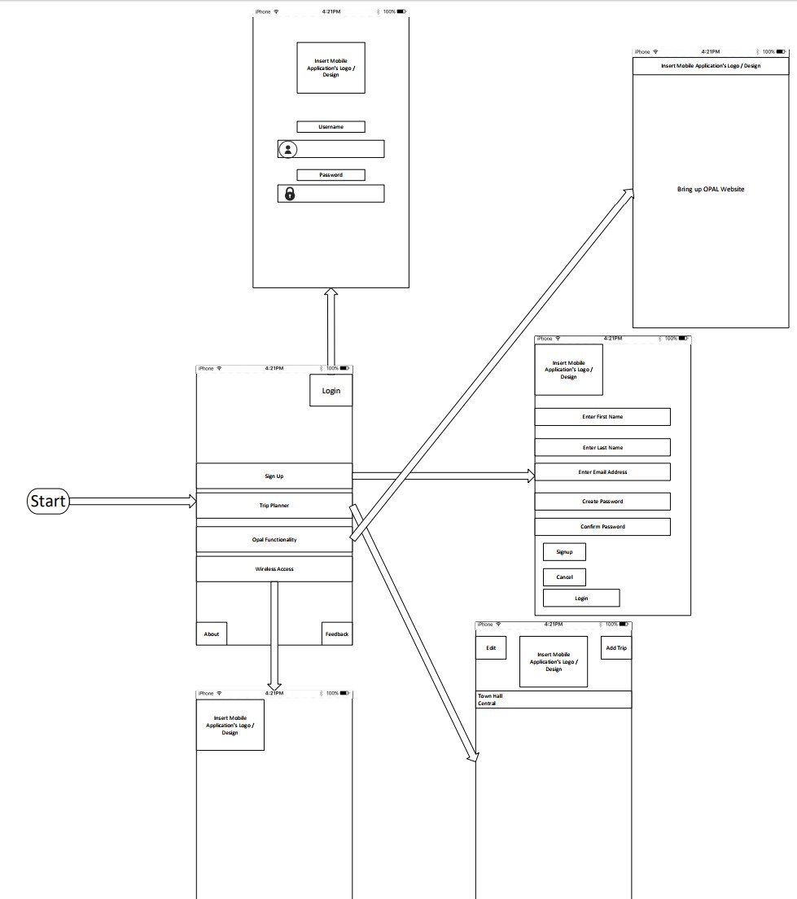

*Figure 3 - Design 1*

The following designs were some preliminary ideas of what we would want the final mobile application to display.

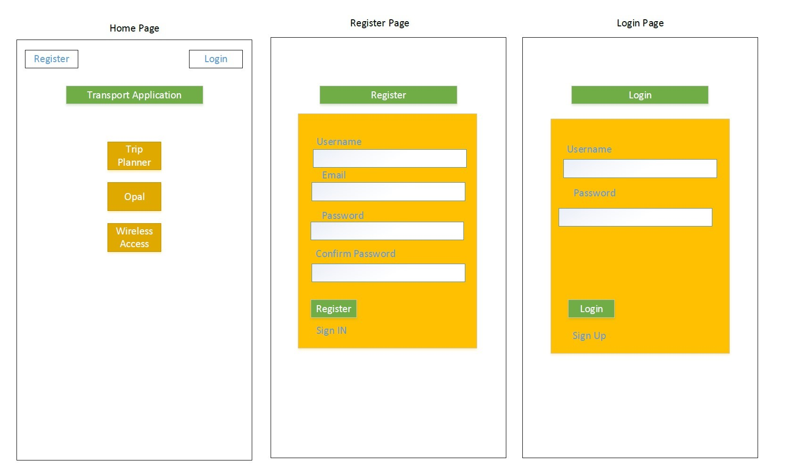

*Figure 4 - Design 2A*

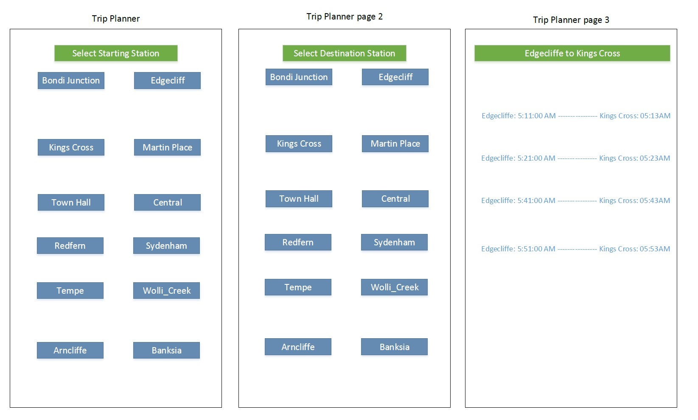

*Figure 5 - Design 2B*

!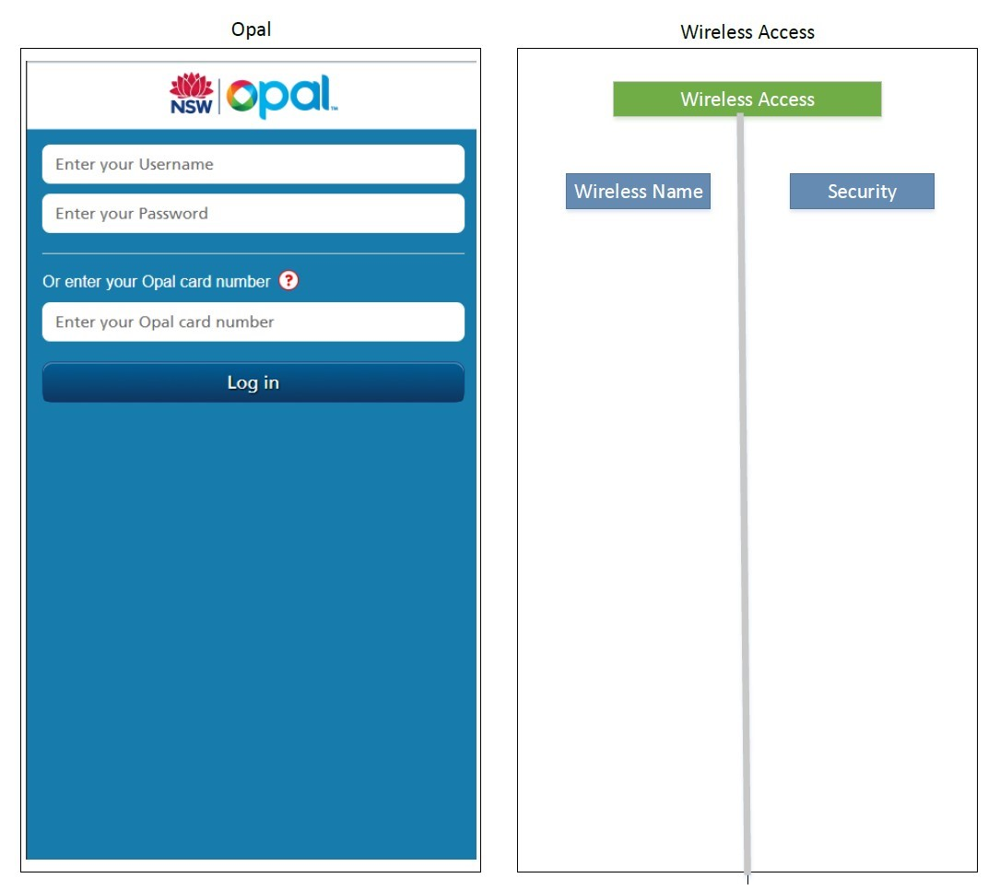

*Figure 6 - Design 2*

#### Wireless -- Hardware Overview 

##### Potential device 

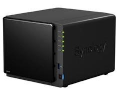

> Synology DS416 4 Bay NAS

The reason why we do not choose Synology NAS:

-   They are over-expensive, we can build a PC which has a better performance and lower price.

-   The operating system of Synology is not as friendly as Windows'.

-   The support of video format is lame.

-   They don't use NTFS internally. When you move data from NTFS to another file system, there is a potential for issues to arise.

-   They are proprietary devices. So there could be some limitations in manufacturer's device.

-   Synology NAS is at times buggy and raises security risks.

-   Their FTP servers are partially incompatible with standard FTP protocols.

-   Synology NAS types appear to fail under high load. This has been confirmed by online customers' feedback

-   Network links break randomly under high load during transmission with Synology NAS.

-   DNS issues: It happens under high load and long simultaneous transfers that NAS boxes become inaccessible via their DNS or network name.

-   Synology NAS boxes power off and go into standby mode but do not power back on properly.

##### Our Device 

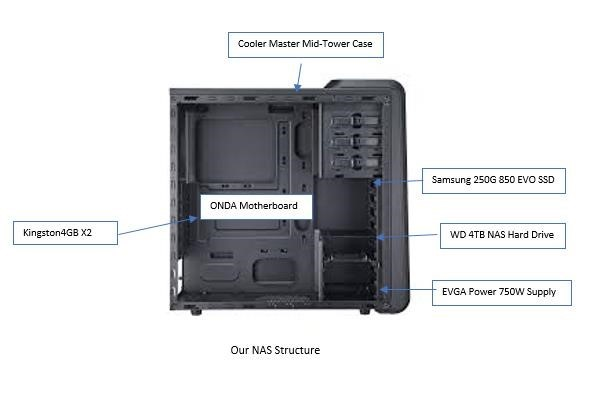

**Motherboard**: we need to find a motherboard which has already integrated a CPU, because firstly, it lowers the noise of the fan since it does not have an independent CPU. Secondly, the performance of CPC is higher than manufacturer's NAS. Thirdly, the video card which is on the motherboard supports 4K video streaming. Then, ONDA Motherboard has Dual anti-static and lightning protection can effectively protect itself, it also has SATA 2.0 transmission which can obtain a higher transfer rate and three PCIE ports. The feature of gigabit ethernet card is essential for NAS.

**Memory**: The choice of memory is not a big issue, we only need two 4GB memory like most of PCs have.

**Case**: It has three optical drive trays which are relatively enough as it supports four HDDs and up to three SSDs. Cooler Master Mid-Tower Case also supports up to 6 fans. It has included many ways to make maintaining our NAS convenient. Two tool-less side panels make accessing our components a fast and trouble-free experience. A removable top, front, and bottom dust filter protect your system from dust intake and are easily cleaned.

**Power supply:** Our requirement of power supply must be 80 plus gold because the certification ensures the power supply is not wasting power and turning it into excess heat. During our research, we found EVGA Power 750W Supply has the best cost performance.

**SSD**: The reason why we choose to install an operating system on SSD because it has faster boots, better cooling, less fan noise, increases energy efficiency and reliability. The best brand of SSD, for now, is Samsung. So we choose Samsung 250G 850 EVO SSD to install an operating system. The maximum reading speed of Samsung 850 is 540 MB/s and write speed is 520 MB/s, and thereby it is competitive. Plus, the price of Samsung 850 SSD is not expensive compare to the others.

**HDD:** WD 4TB NAS Hard Drive is built for NAS. It has low temperatures, noise levels and power consumption. The feature of Intelligent Error Recovery attracts us a lot, since with built-in intelligent error recovery controls, NASware also prevents hard drives from being dropped off the redundant array of independent disks(RAID) due to extended error recovery. This feature provides more availability and less down time when rebuilding the RAID. NASware is WD's technology which improves storage performance by reducing common hard drive concerns in NAS systems.

**Router & Switch & Access Point(AP):** To choose these three network devices, we get some advices from Ubiquiti company. Their AP supports simultaneous dual-band, 3x3 MIMO technology in the 5 and 2.4 GHz radio bands. Ubiquiti Access point has scalable enterprise Wi-Fi management, with its software-based capabilities, the Unifi virtual control plane allows for unlimited scalability under one centralized controller.

Netgear Nighthawk router has VPN support which secures remote access, and it has double firewall protection which are SPI and NAT. For Cisco smart switch, we do not need to talk about much, since every user knows the good performance of Cisco switch.

*The table below will be covering the device requirements for our wireless function on the train. Device types can be group into two categories: NAS and network devices.*   
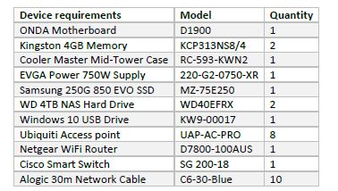