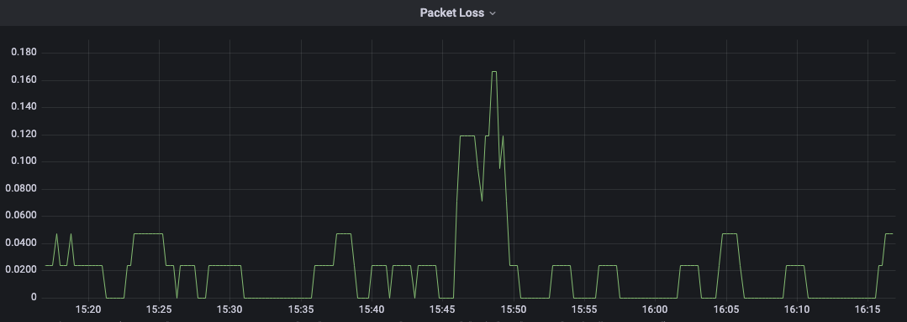

## Background

Since people started working from home, poor video/voice call connections have become a very annoying problem. 

However, it's hard for people to diagnose what is the root cause. People start blaming their ISPs, and I feel bad for them. In fact, there are a number of reasons that can cause poor video call connections, but if you can tell us with great confidence that my problem is not from your end.

You should probably start monitoring your ISP  packet loss.

## Prerequisites

- Grafana(You can register a free [Grafana Cloud account](https://grafana.com/auth/sign-in?plcmt=top-nav&cta=myaccount))
- Prometheus (You can [install it](https://prometheus.io/docs/prometheus/latest/installation/) on your Raspberry Pi or NAS)
- Open Source Router OS (OpenWRT, ClearOS, Asuswrt-Merlin etc)

## Process

### Set Up ping_exporter

SSH in to your router > Download ping_exporter

You can check which version you need [here.](https://github.com/czerwonk/ping_exporter/releases)

For example: 

```bash
wget https://github.com/czerwonk/ping_exporter/releases#:~:text=ping_exporter_0.4.7_linux_arm64.tar.gz
```

Extract the file:

```bash
tar -xf ping_exporter_*.tar.gz ping_exporter
```

Move to `/usr/local/bin`:

```bash
mv ping_exporter /usr/local/bin
```

Choose the way you like to get the ISP's DNS servers on your router.

For example:

```bash
cat /etc/resolv.conf
```

Create a `ping_exporter.yaml` file under `/etc/ping_exporter/`:

```bash
targets:
  - <Your ISP's DNS servers>

ping:
  interval: 2s
  timeout: 3s
  history-size: 42
  payload-size: 120
```

Create a `ping_exporter.service` file under `/etc/systemd/system/`:

```bash
[Unit]
Description=ping_exporter

[Service]
User=root
ExecStart=/usr/local/bin/ping_exporter --config.path /etc/ping_exporter/ping_exporter.yaml
Restart=always

[Install]
WantedBy=multi-user.target
```

Reload the service files:

```bash
sudo systemctl daemon-reload
```

Start your `ping_exporter.service`:

```bash
sudo systemctl start ping_exporter.service
```

Check the status of your `ping_exporter.service`:

```bash
sudo systemctl status ping_exporter.service
```

To enable your `ping_exporter.service` on every reboot:

```bash
sudo systemctl enable ping_exporter.service
```

Get the results for testing via cURL:

```bash
curl http://localhost:9427/metrics
```

### Add a target to Prometheus

In your Prometheus configuration file, add the target in the `static_config` section :

```bash
- targets: ["<Your router's ip/dns address>:9427"]
```

The reload your Prometheus’ configuration.

### Create a Grafana Panel

Add a new Panel in your home network's dashboard, we are going to use the `ping_loss_percent` metric.

```bash
ping_loss_percent{instance="<Your router's ip/dns address>:9427",target="<Your ISP's DNS servers>"}
```



⚠️  Please note for voice and video calls, any packet loss below 0.05 could be considered acceptable.