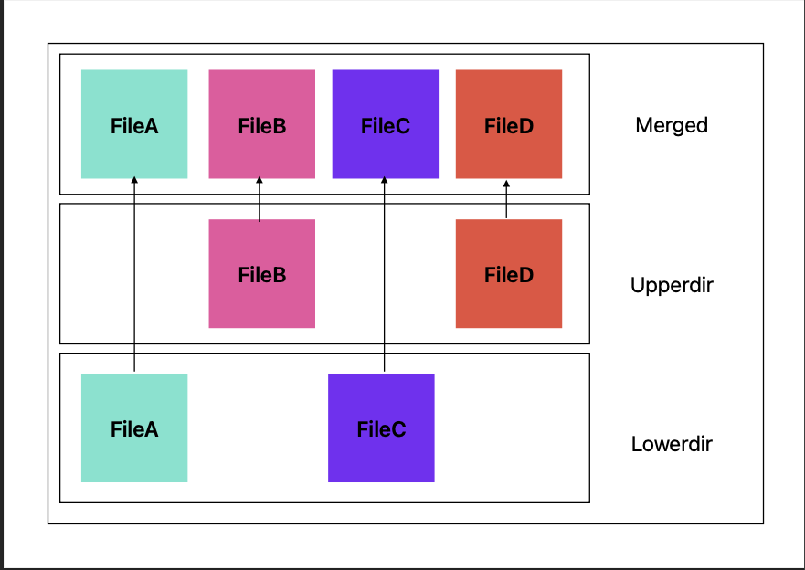
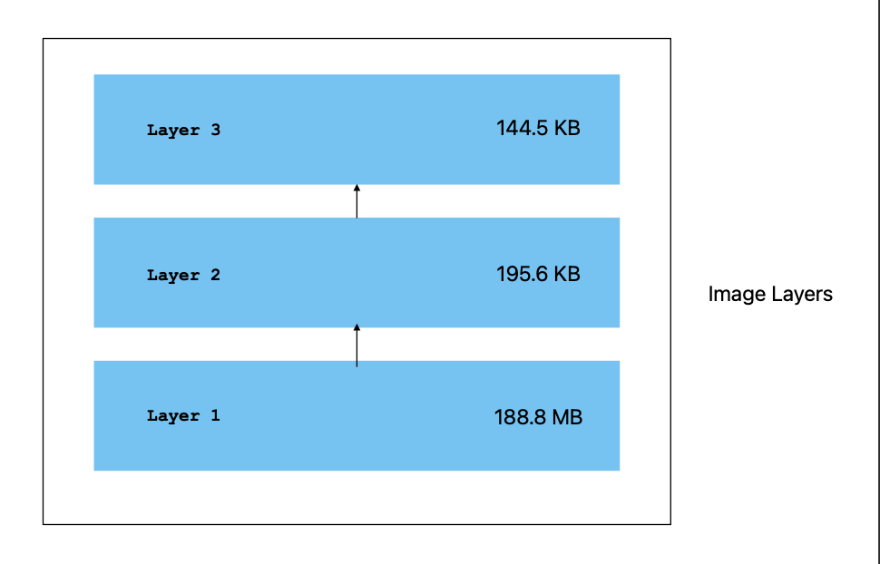
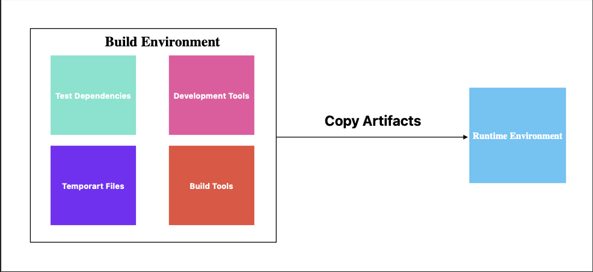
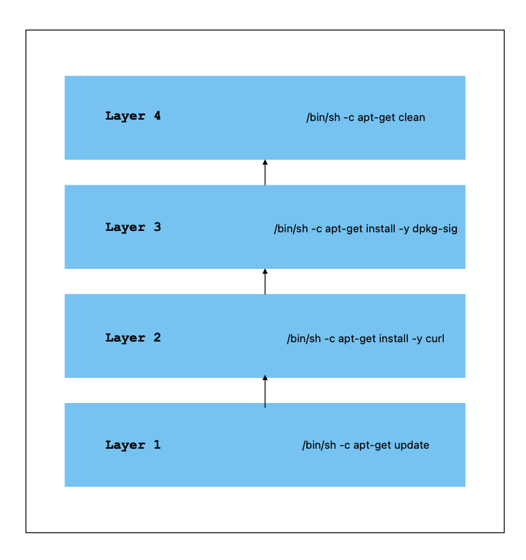

## Background

Docker has revolutionised the way we deploy and run applications, by providing a lightweight and portable way to package and distribute software. Building a high-quality Docker image is essential for ensuring that your application runs smoothly and efficiently in production. In this blog post, we will discuss some key considerations and best practices for building a high-quality Docker image from my own experience. 

## How Container Works

To understand how container works, we need to understand how Linux overlay work. 

Linux overlay is a filesystem that allows the user to stack multiple filesystems on top of one another. Each filesystem has its own set of files and directories that are independent from the underlying filesystem. This allows to merge two directories together and present them as a single unified filesystem. One of these directories, known as the "lower" directory, is read-only, while the other directory, known as the "upper" directory, can be both read from and written to. When a process reads a file from the overlay filesystem, the overlays driver first checks for the file in the upper directory. If it is not found there, it falls back to the lower directory. When a process writes a file, it is always written to the upper directory. This allows you to modify or add new files in the upper directory without changing the original files in the lower directory. 



Let us apply this knowledge to Docker images. When pulling a new image, if layer 2 already exists, it will not pull any layers below layer 2.



## #1 - M**ulti-Stage Builds Orders**

Using what we have learned earlier, to optimize the efficiency of your Docker builds, you should order the layers in your build from the least frequently changed to the most frequently changed. This will allow the build cache to be reusable and improve build times.

Here is an example:

```jsx
FROM python:3.7-buster

# copy the requirements file 
COPY requirements.txt /app

# create and set the working directory
RUN mkdir -p /app
WORKDIR /app

# copy the source code
COPY . /app

# install system dependencies
RUN apt-get update && apt-get install -y build-essential libpq-dev

# install Python dependencies
RUN pip install -r requirements.txt

# expose the port that the app will run on
EXPOSE 5000

# run the app
CMD ["python", "app.py"]
```

Is this a good example? The answer is no. First, we should install system dependencies, then copy the requirements file only, and install Python dependencies. Always remember to order them from the less frequently changed  to the more frequently changed.

Here's how we can fix it:

```jsx
FROM python:3.7-buster

# install system dependencies
RUN apt-get update && apt-get install -y build-essential libpq-dev

# copy the requirements file and install Python dependencies
COPY requirements.txt /app
RUN pip install -r requirements.txt

# create and set the working directory
RUN mkdir -p /app
WORKDIR /app

# copy the source code
COPY . /app

# expose the port that the app will run on
EXPOSE 5000

# run the app
CMD ["python", "app.py"]
```

## #2 - Build Environment VS Runtime Environment

Use a multi-stage build to separate the build environment from the runtime environment. This will enable you to use a larger base image for the build stage, and then only copy the necessary files to the smaller runtime image. 



Here is an example:

```jsx
FROM maven:3.6.3-jdk-11 as build
COPY src /app/src
COPY pom.xml /app
RUN mvn -f /app/pom.xml clean package

FROM openjdk:11-jre-slim as run
COPY --from=build /app/target/*.jar /app.jar
EXPOSE 8080
ENTRYPOINT ["java", "-jar", "/app.jar"]
```

This Dockerfile uses the `maven:3.6.3-jdk-11` base image for the build stage and the `openjdk:11-jre-slim` base image for the runtime stage. The build stage compiles the source code and creates a JAR file, which is then copied to the runtime image. 

This can be especially useful if the build stage requires a lot of dependencies or tools that are not needed at runtime. For example, if the build stage uses a base image that is 1 GB in size and the runtime stage uses a base image that is 100 MB in size, using this method can potentially save 900 MB in image size.

## #3 - The Package Cache

The package cache is a local repository of package files that are downloaded from the Internet or other sources. When you use **`apt-get`** to install a package, the package files are downloaded to the package cache so that they can be easily accessed and used to install the package. However, as you install more and more packages, the package cache can grow quite large.

Here is an example:

```jsx
FROM ubuntu:18.04-slim
RUN apt-get update 
RUN apt-get install -y curl 
RUN apt-get install -y dpkg-sig 
RUN apt-get clean 
```

Is the package cache cleaned? The answer is no. As previously discussed, each Docker layer has its own set of files and directories that are separate from the underlying filesystem.

Running `apt-get clean` only clears the package cache on layer 4.



Here's how we can fix it:

```jsx
RUN apt-get update && apt-get install -y \
    curl \
    dpkg-sig \
 && apt-get clean
```

## Reference

Evans, Julia. (2019). "How containers work: overlayfs." Retrieved from [**https://jvns.ca/blog/2019/11/18/how-containers-work--overlayfs/**](https://jvns.ca/blog/2019/11/18/how-containers-work--overlayfs/)

